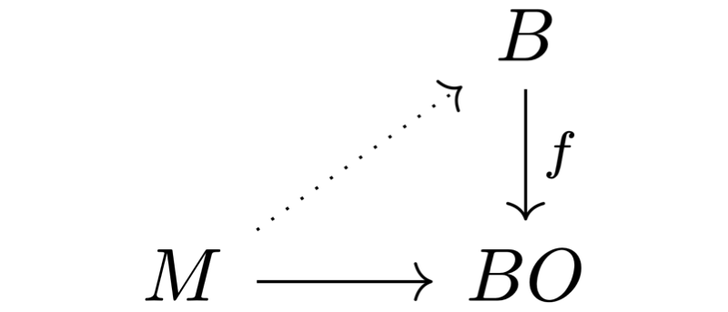

In the next couple years I will need to understand the ins and outs of different cohomology theories and the spectra that represents them. Some of the most important of these (for my research) can be described using $MU$ — the complex cobordism spectrum. We briefly met this spectrum — or at least its cohomology theory — when we discussed [formal group laws](). There we explained briefly a theorem of Quillen, stating that the universal formal group law over the Lazard ring corresponds to complex cobordism cohomology. We did not cover what complex cobordism actually is, so that is the plan for this post. 

Let us again quickly describe the backdrop for why this is important. We are interested in understanding Landweber exact complex oriented cohomology theories. All these are formed by taking a product with the universal such theory, i.e. the universal complex oriented cohomology theory. This theory is precisely complex cobordism cohomology. It is universal in the sense that any complex orientation on some multiplicative cohomology theory $E$ can be realized as a map $MU\longrightarrow E$. We will describe all this during this post, but first we need to understand what $MU$ actually is.

## Stably complex manifolds

We have already seen cobordisms a couple of times already, and each time it has featured as a relation between two manifolds. This relation is called the cobordism relation. 

 **Cobordism relation:**  Let $M$ and $N$ be manifolds of dimension $n$. We say they are *cobordant* if there is a manifold $W$ of dimension $n+1$ such that $\partial W = M\sqcup N$, i.e. the boundary of $W$ is the disjoint union of $M$ and $N$. 

The name of the cobordism theory we are interested in is called complex cobordism, so due to the name one might expect that we simply consider cobordisms of complex manifolds. But, as you might see, if $M$ and $N$ are complex manifolds, then they have dimension $2n$ for some $n$. A cobordism would then have dimension $2n+1$, but then it can't have a complex structure. We can work around this by introducing so-called stably complex structures instead. These are a simple enough generalization that allow complex-like structures in odd dimensions. 

Given a manifold $M$, we can study its tangent bundle $TM$. As a set this consists of all tangent spaces $T_pM$ at each point $p\in M$. We define an almost complex manifold to be a $2n$-dimensional manifold $M$ together with a choice of an isomorphism $TM\overset{\cong}\longrightarrow \xi$ for some complex vector bundle $\xi$ over $M$. This is the same as a choice of complex structure on $\xi$. In order to generalize this to manifolds of odd dimensions we simply add the option to have extra dimensions in the tangent bundle, i.e. $TM\oplus \underline{\R}^k$ instead of just $TM$. Here $\underline{\R}^k$ is the trivial real vector bundle $M\times \R^k$. 

 **Definition:**  A *stably complex manifold* is a manifold $M$ together with a choice of isomorphism 

$$c:TM\oplus \underline{\R}^k \overset{\cong}\longrightarrow \xi$$

for some complex vector bundle $\xi$. As this requires a choice we sometimes denote these by a pair $(M, c)$. If there is no confusion we just use $M$.  

Now we have complex-like structures for manifolds in all dimensions, which allows us to define complex cobordism. 

 **Definition:**  Let $M$ and $N$ be two stably complex manifolds of dimension $n$. We say they are *complex cobordant* if there is a stably complex manifold $W$ of dimension $n+1$ such that $\partial W = M\sqcup N$. 

Here $\sqcup$ denotes disjoint union. We sometimes split the boundary $\partial W$ into an "in-boundary" and an "out-boundary", which is simply a way to assign a direction to the cobordism. We then write $\partial W_+ = M$ and $\partial W_- = N$, which intuitively means that the cobordism "goes from" $M$ to $N$. A picture might help:

This can also be described in the context of $B$-cobordisms, i.e. cobordisms with some extra structure in the form of a [fibration]() $\beta: B\longrightarrow BO$, where $BO$ is the classifying space of the infinite orthogonal group $O(\infty)$ that we met [last time](). A vector bundle $\xi$ over a manifold $M$ is classified by a map $M\longrightarrow BO$. We say it is a $B$-manifold if there is a lift through the fibration $\beta$. Complex cobordism theory then corresponds to the cobordism theory of $BU$-manifolds, where $BU$ is the classifying space of the infinite unitary group. This is maybe better described by a diagram:

We will not need this language of $B$-cobordisms, but it is a nice generalization of the story presented here today. 

## Cohomology from geometry

Now that we know what complex cobordisms are we need to understand how we get a cohomology theory. Recall that a cohomology theory is a functor from topological spaces to graded abelian groups satisfying the generalized Eilenberg-Steenrod axioms. We have described these before, so look at [this post]() for a more in depth recollection. There are two ways of approaching this for complex cobordism: one geometric, and one abstract. The geometric construction only works well for manifolds, hence why we also have a more general second construction. But, as it is nice with some geometry, we also present the former. 

Let $X$ be a manifold of dimension $n$, $M$ and $N$ be stably complex manifolds of dimension $(n-k)$ together with maps $f:M\longrightarrow X$ and $g:N\longrightarrow X$. Furthermore we require that these maps are proper — that the inverse image of a compact subset is compact — and that that the stable normal bundles, $N(f)$ and $N(g)$, are stably complex. Such maps are called complex oriented. We say two complex oriented maps are complex cobordant if there is a complex cobordism $W$ such that $\partial W = M\sqcup N$ and a map $h:W\longrightarrow X\times I$ such that $f = h_{|(h^{-1}(X\times \{0\}))}$ and $g=h_{|(h^{-1}(X\times \{1\}))}$, i.e. the restriction of $h$ to the fibers over the endpoints of $I$ correspond to $f$ and $g$. This relation is an equivalence relation. Hence we define the set $MU^k(X)$ to be the set of complex oriented maps modulo the cobordism relation described. This set is in fact an abelian group under disjoint union. The assignment $X\longmapsto MU^k(X)$ is also functorial in manifolds and satisfies the generalized Eilenberg-Steenrod axioms, hence it is a cohomology theory of manifolds. The reason we cant extend this to all topological spaces is that we are using the stable normal bundles of maps. These only makes sense for manifolds, as they are the ones with defined stable normal bundles. So, to get a cohomology theory for all topological spaces we must try something more general. 

## Cohomology from spectra

The more general approach comes from the fact that all cohomology theories are represented by a spectrum via the [Brown representability theorem](). We construct a nice spectrum, denoted $MU$, that naturally arises from complex cobordism and then define a cohomology theory from this spectrum. The construction that gives us the spectrum is called the Pontrjagin-Thom construction. We will explain all the steps, but let's first establish a guide for how we get there: 

1. Define the complex cobordism group
2. Under the Pontrjagin-Thom construction this group is isomorphic to the homotopy groups of some spectrum
3. Under Brown representability this spectrum represents a cohomology theory
4. Profit

We might not get to stage four, but we will at least describe the three first ones. The first thing we need is the complex cobordism group. You might recall that we looked at the $h$-cobordism group of the spheres in the [previous post]() looking at stable homotopy groups of spheres. The construction of a general cobordism group is similar, but this time we don't restrict ourselves only to the spheres. As a set, the $n$'th complex cobordism group consists of complex cobordism classes of closed stably complex $n$-manifolds, i.e. 

$$\Omega^{U}_n = \{(M, c)\}/\sim$$

where two stably complex $n$-manifolds are equivalent $(M,c_M)\sim (N, c_N)$ if there is a complex cobordism $W$ such that $\partial W = M\sqcup N$, i.e. they are complex cobordant. Being complex cobordant is an equivalence relation because it is

- reflexive by the cylinder cobordism,
- symmetric by swapping the "in" and "out" boundaries and
- transitive by composition of cobordisms,

which means that $\Omega_n^U$ is well defined as a set. The group operation is given by disjoint union, where the inverses are given by

$$-(M, c) = (N,-c)$$

and the identity is the empty set $\empty$ — treated as a manifold of dimension $n$. The group is even abelian because we have $(M, c_M)\sqcup (N, c_N) \sim (N, c_N)\sqcup (M, c_M)$ by a twist cobordism, often visualized as:

We have now completed step one, and so proceed with step two — the Pontrjagin-Thom construction. We will not cover this in high detail but simply state its pieces and parts. This is because we are merely interested in some topological spaces that show up, which will be the components of the spectrum $MU$. 

Let now $M$ be some stably complex manifold of dimension $n$. It has an embedding $i:M\hookrightarrow \R^{n+k}$ which gives us its normal bundle $N(i)$. By the tubular neighbourhood theorem we have a an inclusion $\tau N(i)\hookrightarrow \R^{n+k}$, where $\tau N(i)$ denotes the tubular neighbourhood of the normal bundle. Define a map $\R^{n+k}\longrightarrow \tau N(i)$ that is the identity on the interior of $\tau N(i)$ and sends everything else to a point. Hence it defines a map $\R^{n+k}\longrightarrow \tau N(i)/\partial \tau N(i)$. This is a proper map on locally compact Hausdorff spaces, hence it induces a map on the one-point compactifications. The one point compactification of $\R^{n+k}$ is $S^{n+k}$, and we denote the one point compactification of $\tau N(i)/\partial \tau N(i)$ by $T(N(i))$. Hence we have a map. 

$$S^{n+k} \longrightarrow T(N(i))$$

So, from a stably complex $n$-manifold $M$ we have produced a map from a sphere to some compact nice space. This space $T(N(i))$ is called the Thom space of $N(i)$, and is a general and functorial construction. The Thom space of a vector bundle $\xi = (V, B, \pi)$ is constructed as the quotient bundle of the disc-bundle (the vectors of length less than one) by its boundary (the unit length vectors), i.e. $T(V) = D(V)/S(V)$. The classifying space $BU(k)$ has a universal vector bundle $\gamma_k = (EU(k), BU(k), \pi)$, and thus the $k$-dimensional normal bundle $N(i)$ admits a map $N(i)\longrightarrow \gamma_k$. This map induces a map on Thom spaces, $T(N(i))\longrightarrow T(\gamma_k)$. By composing this map with the above map from $S^{n+k}$ we get a map

$$\phi_k:S^{n+k}\longrightarrow T(\gamma_k),$$

representing an element in $\pi_{n+k}(T(\gamma_k))$. The inclusion $i:BU(k)\hookrightarrow BU(k+1)$ gives an isomorphism $i^\ast\gamma_{k+1}\cong \gamma_k\oplus \mathbb{1}$ , where $\mathbb{1}$ is the trivial complex line bundle over $BU(k)$. The Thom space of $\gamma_k\oplus \mathbb{1}$ turns out to be $\Sigma^2 T(\gamma_k)$. This makes sense intuitively, as $T(\gamma_k)$ is roughly the one-point compactification of a real vector bundle, i.e. a sphere, which when suspended twice should give a sphere in two dimensions higher, which again should be a one-point compactification of a vector bundle with complex dimension increased by one. This gives us maps $\Sigma^2 T(\gamma_k)\longrightarrow T(\gamma_{k+1})$. We can then finally define $MU$.

 **Definition:**  The complex cobordism spectrum $MU$ consists of topological spaces $MU_{2k} = T(\gamma_{k})$ and $MU_{2k+1}=\Sigma T(\gamma_k)$. The structure maps $\sigma_n : \Sigma MU_n \longrightarrow MU_{n+1}$ is given by the identity for $n=2k$ and by the above described map $\Sigma^2 MU_{2k} \cong \Sigma MU_{2k+1}\longrightarrow MU_{2k+2})$ for $n=2k+1$. 

This is the spectrum we need to define the cohomology theory, but in the interest of completing the story and the construction we mention the famous result that the Pontrjagin-Thom construction gives us. Taking the colimit of the homotopy groups $\pi_{n+k}(T(\gamma_k))$, we see that we get the homotopy groups of the spectrum $MU$, i.e. $colim_k \pi_{n+k}(T(\gamma_k)) = \pi_n MU$. This finally means that a complex cobordism class of a stably complex $n$-manifold, i.e. an element of the abelian group $\Omega^U_n$, now gives through the above construction an element of the abelian group $\pi_n MU$. The remarkable thing about this construction is the fact that this association is an isomorphism of groups. Hence we have 

$$\Omega^U_n \cong \pi_nBU.$$

This is the so-called Pontrjagin-Thom construction and it actually holds for all $B$-cobordism theories, giving several nice isomorphisms to play with. This does then conclude the second point. 

The third point we are luckily already familiar with, as we have covered the Brown representability theorem in an [earlier post](). This theorem gives us for a spectrum — in our case $MU$ — a cohomology theory $MU^\ast(-)= [-, MU^\ast]$, i.e. homotopy classes of maps into the spectrum. Importantly, the groups $MU^k(X)$ for some manifold $X$ agrees with the earlier geometric construction of complex cobordism classes of complex oriented maps into $X$. As we have covered this theory in detail before, we instead continue to the stuff mentioned in the introduction. The important part is that we now have a spectrum $MU$ that we know how to construct, and we know how relates to geometry. 

## What do we know about $MU$?

As $MU_{2n} = T(\gamma_n)$ we have in particular that $MU_2 = T(\gamma_1)$ where $\gamma_1$  is the universal complex line bundle over $BU(1)$. The topological space $BU(1)$ is modeled by a colimit of Grassmann manifolds, $Gr_1(\mathbb{C}^k)$, as $k$  goes to infinity. The first Grassmannians is the same as complex projective space, so $BU(1)$ is modelled by $colim_k \mathbb{C}P^k = \mathbb{C}P^\infty$, the infinite complex projective space. 

The cool thing is that the Thom space of the universal complex line bundle is homotopy equivalent to the base-space, i.e. $\mathbb{C}P^\infty$. The homotopy equivalence is induced by the zero-section on $\gamma_1$. Hence we get that $MU_{2} \simeq \mathbb{C}P^\infty$. By convention we have $BU(0)\simeq pt$ and by definition: a zero dimensional vector bundle over a point is still just a point. This means that a zero dimensional vector bundle over $BU(0)$ is a trivial bundle. The Thom space of a trivial bundle of dimension $n$ is the $n$'th suspension of the base-space with a disjoint basepoint. For $n=0$ the zeroth suspension is the identity, and hence we are left with $T(\gamma_0)=pt_+$, i.e. a point with a disjoint basepoint. Such a space is just the zero-sphere, hence we have $MU_0 = S^0$. 

Since $BU$ is given by Thom spaces of universal vector bundles, we might wonder if we can use this to construct some more structure on $MU$. The direct sum of two complex vector bundles of dimension $n$  and $m$ are classified by a map $BU(n)\times BU(m)\longrightarrow BU(n+m)$. For universal bundles over these we get induced maps on Thom spaces

$$T(\gamma_n\oplus \gamma_m)\longrightarrow T(\gamma_{n+m}),$$

and for any vector bundles the Thom space of a sum is the wedge of the Thom spaces. Hence we get a map 

$$T(\gamma_n)\wedge T(\gamma_m)\longrightarrow T(\gamma_{n+m})$$

which induces a multiplication $MU\times MU\longrightarrow MU$. This means in particular that $MU$ is a multiplicative spectrum, and that complex cobordism cohomology is a multiplicative cohomology theory. 

This multiplicative structure gives us a ring structure on $\pi_\ast MU \cong MU^\ast(pt)$. Recall that for a manifold $X$, the group $MU^n(X)$ is the complex cobordism class of complex oriented maps into $X$. If we let $X=pt$ then all maps into $X$ are complex oriented, and they are cobordant precisely when their codomains are complex cobordant. Hence the group $MU^n(pt) \cong \Omega^U_n$. Taking the direct sum of all these we get a ring $MU^\ast(pt)\cong \Omega_\ast^U$ called the complex cobordism ring. Milnor and Novikov showed that this ring is a polynomial ring in infinitely many variables, i.e. $\Z[v_1, v_2, \ldots]$ where $v_i$ has degree $2i$. 

We have already seen a bit of multiplicative cohomology theories in the earlier post about [formal group laws](). In that post we looked at complex oriented cohomology theories and how to get formal group laws from them. We redo this now in the light of $MU$. 

Recall that a multiplicative cohomology theory is called complex orientable if the map

$$E^2(\mathbb{C}P^\infty)\longrightarrow E^2(S^2)$$

is surjective. A complex orientation is then a choice of an element in the preimage of the canonical generator in $E^2(S^2)$. This generator is often called the first generalized Chern class, or the first Connor-Floyd Chern class, and will be denoted by $c^E$. From the structure maps of $MU$ — those given by $\Sigma^2 MU_{2k}\longrightarrow MU_{2k+2}$ — we get for $k=0$ a map 

$$i:\Sigma^2 S^0 \simeq S^2 \longrightarrow \mathbb{C}P^\infty$$

which is the inclusion map. In $MU$-cohomology this induces a map 

$$i^\ast:MU^2(\mathbb{C}P^\infty)\longrightarrow MU^2(S^2)$$

The group $MU^2(\mathbb{C}P^\infty)$ is given by $[\mathbb{C}P^\infty, MU_2]$ — the homotopy classes of maps into the complex cobordism spectrum — which through the homotopy equivalence between $MU_2$ and $\mathbb{C}P^\infty$ is isomorphic to the set $[\mathbb{C}P^\infty, \mathbb{C}P^\infty]$. The class of the identity map then corresponds to an element $c^{MU}\in MU^2(\mathbb{C}P^\infty)$. This element gets sent to $t$, the canonical generator of $MU^2(S^2)$ under the induced inclusion map, i.e. $i^\ast(c^{MU})=t$. Hence $MU$ is complex oriented, and moreover, the choice of complex orientation is completely natural and engrained into the structure of the spectrum itself. It is often called the universal complex orientation of $MU$. It is universal in the sense that for any other complex oriented cohomology theory $E^\ast$ with complex orientation $c^E$, there is a (up to homotopy) unique map of ring spectra $u:MU\longrightarrow E$ such that the induced map in the second cohomology of $\mathbb{C}P^\infty$

$$u_\ast:MU^2(\mathbb{C}P^\infty)\longrightarrow E^2(\mathbb{C}P^\infty)$$

sends the universal complex orientation $c^{MU}$ to $c^{E}$, i.e. $u_\ast(c^{MU})=c^{E}$. 

For any complex oriented cohomology theory $E^\ast$ with complex orientation $c^E$, we get that the $E$-cohomology ring of $\mathbb{C}P^\infty$ is given by $E^\ast(\mathbb{C}P^\infty)\cong \pi_\ast E[[c^E]]$, i.e. the power series ring over its coefficient ring. The space $\mathbb{C}P^\infty$ is a H-space, with a multiplication induced from the tensor product of vector bundles. In $E$-cohomology this gives a map 

$$m^\ast :\pi_\ast E[[c^E]]\cong E^\ast(\mathbb{C}P^\infty)\longrightarrow E^\ast(\mathbb{C}P^\infty\times\mathbb{C}P^\infty)\cong \pi_\ast E[[x,y]]$$

where the image of the complex orientation $c^E$ under $m^\ast$ is some power series $f(x, y)$. This power series is a formal group law over the ring $\pi_\ast E$. The essentially unique map that gives $c^E$ from $c^{MU}$, i.e. the ring spectrum map $u:MU\longrightarrow E$, induces a map 

$$u_\ast:MU^\ast(\mathbb{C}P^\infty)\cong \pi_\ast MU[[c^{MU}]]\longrightarrow  E^\ast(\mathbb{C}P^\infty) \cong \pi_\ast E[[c^E]]$$

 that maps the formal group law $m^\ast(c^{MU})$ over $\pi_\ast MU$ to the formal group law $m^\ast(c^E)$ over $\pi_\ast E$. This means that the formal group law over the complex cobordism ring acts like a universal formal group law for complex oriented cohomology theories. One can then ask, does it act as the universal formal group law among all possible formal group laws? Or equivalently, can we get every formal group law from a cohomology theory? 

In the earlier mentioned post describing these [formal group laws]() we looked at a remarkable theorem by Quillen, stating that this is precisely the case. The formal group law we get from complex cobordism — the image of $c^{MU}$ under the map $m^\ast$ — is the universal formal group law $f$ over the Lazard ring $L$, the ring that classifies formal group laws. This means in particular that we have a natural isomorphism $\pi_\ast MU\cong L \cong \Z[v_1, v_2, \ldots]$, and $m^\ast(c^{MU}) \cong f$. 

## Round off

I think this is enough of complex cobordism for today, but we will definitely see it again. The reason we construct it in detail is because we want to use it later to construct other important cohomology theories: Brown-Peterson cohomology, Johnson-Wilson theory and Morava K-theory. The latter is especially important for my research projects, so understanding its construction properly will probably be beneficial.