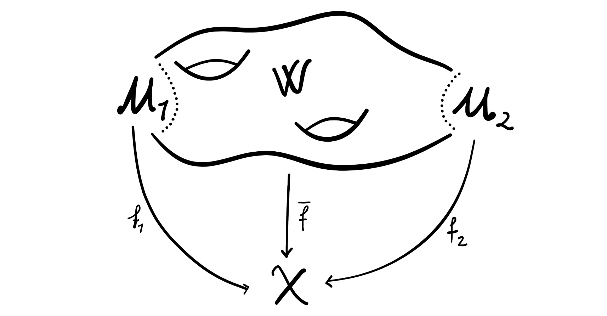

Recently we have covered a lot of heavy topology and abstract mathematics, so today I thought we would cover something else — something maybe a bit easier to grasp. We will introduce the concept of formal group laws, and a bit on why they are interesting. 

## Introduction and definition

To not just spew out the definition straight away, we look at a situation where formal group laws arise very naturally. Let $G$ be a one-dimensional commutative Lie group (Think here of the real numbers $\mathbb{R}$ or the circle group $S^1$). This group has a continuous product, $m:G\times G\longrightarrow G$, which locally can be described by a real-valued function in two variables. This function has a Taylor expansion around the origin, which is a power series in two variables. Denote this power series by $F$. This power series satisfies some axioms because of the group structure we have on $G$, these axioms are identity, commutativity and associativity. In more mathematical terms this means that the following statements hold

1. $F(u,0)=u=F(0,u)$ (identity)
2. $F(u, v)=F(v, u)$ (commutativity)
3. $F(F(u, v), w) = F(u, F(v, w))$ (associativity)

These axioms are not at all satisfied by all power series, so these are actually something interesting to look at. Coincidentally, such power series are exactly what we are going to look into today, because this is exactly what a formal group law is. 

**Definition (Formal group law):** A *formal group law*[^1] over a commutative ring $R$ is a power series $F\in R[[u,v]]$ satisfying the above three axioms 1, 2 and 3. 

Hence, we can think of formal group laws as a sort of generalization of the above case of the Lie-group, i.e. some power series with coefficients in a ring that behaves like if it was the product on a Lie group. In the Lie group case our ring was the field of real numbers $\mathbb{R}$, but in general it could be any commutative ring. For the rest of the post any ring will be commutative with an identity. 

We did not mention anything about inverses, which always are somewhere close when talking about groups or group like things. The reason we didn't include it as an axiom is because it isn't needed, due to the following result. 

**Proposition (Inverses):** Let $F$ be a formal group law over a ring $R$. Then there is a power series $i$ in one variable, such that $F(u, i(u))=0$. 

By commutativity this is a two-sided inverse. This power series $i$ is often called the formal inverse of $F$, or sometimes just the inverse. Let's see some examples.

### Examples

There are of course infinitely many examples of formal group laws, but the following two are the most interesting for us. Why this is so will become clear later. 

1. The additive formula $F_a(u, v) = u+v$ over any ring $R$ is a formal group law, called the additive formal group law.
2. The multiplicative formula $F_m(u,v)= u+v+u\cdot v$ over any ring $R$ is a formal group law, called the multiplicative formal group law.

Just to mention a couple more; there are ways to associate to an elliptic curve a formal group law. This has nice use cases in number theory. As mentioned in the introduction, there are also formal group laws coming from the multiplication on Lie groups. There is also a formal group law coming from hyperbolic tangent addition, namely $F(u,v)= \frac{u+v}{1+u\cdot v}$. This is used in physics to add velocities in special relativity. 

A nice feature of formal group laws is that they naturally come with easily definable morphisms between them. These are defined as follows. 

**Definition (Morphism):** Let $F$ and $G$ be formal group laws over a ring $R$. A *morphism* $f:F\longrightarrow G$ is a power series $f$ in one variable with vanishing constant term, such that $f(F(u,v)) = G(f(u), f(v))$. 

We can of course use this to define isomorphisms of formal group laws by being the morphisms with inverses. We also define a *strict isomorphism* $I$ to be an isomorphism where the coefficient of the variable is $1$, i.e. the derivative evaluated at $0$, $I'(u) = 1$. Morphisms of formal group laws are sometimes called *substitutions* and strict isomorphisms of formal group laws are also called *coordinate changes*, as this is essentially what they do. 

These notions of morphisms allow us to understand how certain formal group laws behave, and how they are related. It can be shown that over the rational numbers every formal group law is strictly isomorphic to the additive formal group law, i.e. is the additive one up to a coordinate change. Over other rings this is not true, so most of the interesting theory comes from trying to understand formal group laws over more general rings or fields of positive characteristic. As these notions of strict isomorphisms to the additive formal group law is important, as is is the simplest formal group law we also make the following definition.

**Definition (Logarithm):** Let $F$ be a formal group law over a ring $R$. A strict isomorphism $I$ from $F$ to $F_a$ — the additive formal group law — is called a logarithm of $F$, denoted $I(u) = log_F(u)$.

The name comes from the equation defining the morphism, as it becomes 

$$log_F(F(u,u))=log_F(u)+log_F(v),$$

which looks like the addition formula for normal logarithms. 

We remarked above that all formal group laws are strictly isomorphic to the additive one over the rationals, so there should for all formal group laws exist a logarithm. For example, the multiplicative formal group law has a logarithm given by

$$log_F(u)=\sum_{i\geq 0} \frac{(-1)^{i-1}u^i}{i}$$

This is a logarithm only over the rationals, not over for example the integers. 

The abstract minded reader might see that the assignment of the set of formal group laws over a given ring $R$ is indeed a functor, denoted $FGL(-)$, from the category of commutative rings to the category of sets. The morphisms are the natural transformations of this functor to itself. 

## Really no topology?

Did you really think that we could leave behind the heavy topology and abstract mathematics? that we could just simply enjoy this concept for itself and not for its use in topology? In that case you were wrong... 

All fun and mockery aside, the reason I read about formal group laws was because of an incredible result by Quillen. This says in essence that the universal complex-oriented cohomology theory determines, and is determined by, the universal formal group law. A truly wild connection, but a connection we will see fits nicely into the picture of cohomology theory we have been studying recently. 

### Complex-oriented cohomology theories

[Last time]() we studied reduced cohomology theories, but this additional adjective — reduced —  implies the existence of "unreduced" cohomology theories, more often named simply *cohomology theories*. Luckily, these are roughly the "same", in the sense that the category of reduced cohomology theories is equivalent to the category of unreduced cohomology theories. A difference to note is that we usually define unreduced cohomology theories on pairs $(X, A)$ of topological spaces, i.e. spaces $X$ with a designated subspace $A$.  If we have a reduced cohomology theory $\widetilde{E}^\ast$ then we can define its corresponding cohomology theory by $E^\ast(X, A) = \widetilde{E}^\ast(X_+\cup Cone (A_+))$, where $X_+$ denotes taking the space $X$ and adding a disjoint base point. We have the following decomposition of a cohomology theory:

$$E^\ast(X) = \widetilde{E}^\ast(X)\oplus E^\ast(pt),$$

which means that as long as we know what the unreduced cohomology of a point is, we can simply use the reduced theory if we wish. Above $E^\ast(X) = E^\ast(X, \empty)$. To go from a cohomology theory $E^\ast$  to a reduced one we can define $\widetilde{E}^\ast(X) = E^\ast(X, \\{x\\})$, where $x$ is the base point of $X$.

In order to have a nice connection to formal group laws we need to add a bit of extra structure to our cohomology theories. Firstly, we say our cohomology theory is multiplicative if the spectrum that represents it[^2] has a multiplication that is unital and associative up to homotopy. We have not yet looked properly into spectra, and not at all into ring spectra, but this will come soon. For the moment just accept that there are spectra with multiplications, and that these give cohomology theories with multiplication. If we recall the guiding example of a cohomology theory, namely ordinary singular cohomology, then this has a cup product, so it is in fact a multiplicative cohomology theory. Its representing spectrum — the Eilenberg-Mac Lane spectrum — is the guiding example of a ring spectrum, but as said more on this in another post. 

Just to sure we are clear on notation going forward, we recall that

- $E^\ast$ denotes a cohomology theory,
- $\widetilde{E}^\ast$ denotes the reduced cohomology theory and
- $E$ denotes the spectrum that represents them.

Ok, let's add some more structure to our cohomology theories. 

**Definition (Complex-orientable cohomology theory):** We say that a multiplicative cohomology theory $E^\ast$ is *complex-orientable* if there exists an element $t\in E^\ast(\mathbb{C}P^\infty)$ such that under the map $g:\widetilde{E}^\ast(\mathbb{C}P^\infty)\longrightarrow \widetilde{E}^\ast(S^2)$, $t$ gets sent to the canonical generator $\bar t$ of $\widetilde{E}^\ast(S^2)$. In other words, the map $E^\ast(\mathbb{C}P^\infty)\longrightarrow E^\ast(S^2)$ must be surjective. 

A choice of such a $t$ is called a *complex orientation*, and a multiplicative cohomology theory together with a complex orientation is called a *complex-oriented cohomology theory*. Examples of such theories are ordinary singular cohomology and complex $K$-theory as well as other more exotic theories we will meet in the future, like complex cobordism cohomology and Morava $K$-theory. For ordinary singular cohomology the natural choice of $t$ is given by the first Chern class $c_1(O(1))$, where $O(1)$ is the universal line bundle. This prompts us to actually define this element $t$ for some general cohomology theory $E^\ast$ to be named its first generalized Chern class, or the first Connor-Floyd Chern class. We denote it by $c_1^E$. More specifically we define for a line bundle $L$ over a space $X$, the first generalized Chern class to be $c^E_1(L) = f^\ast t \in E^2(X)$, where $f:L\longrightarrow \mathbb{C}P^\infty$ is the map given by the fact that $\mathbb{C}P^\infty$ is the classifying space for complex line bundles. 

The followup question is then, does this first generalized Chern class satisfy the same nice properties as the normal first Chern class? This turns out in general to not be the case. For example, the normal first Chern class satisfies the following property, that for two line bundles $L_1$ and $L_2$ we have $c_1(L_1\otimes L_2) = c_1(L_1)+c_1(L_2)$. But, for example complex $K$-theory — represented by the spectrum $KU$ — does not have this property, it instead has the following relation: 

$$c_1^{KU}(L_1\otimes L_2) = c_1^{KU}(L_1) + c_1^{KU}(L_2) + c_1^{KU}(L_1)\cdot c_1^{KU}(L_2)$$

It is a bit more complicated, as it features some more elements than just the standard addition featured in the formula for singular cohomology theory. But, this more complicated formula should also look awfully familiar. These two formulas, for singular cohomology and for complex $K$-theory, are in fact the additive and the multiplicative formal group laws that we saw earlier! In fact we have the following theorem.

**Theorem:** Every complex-oriented cohomology theory $E^\ast$ determines a formal group law $F$ over the ring $E^{\ast}(pt)$, i.e. of the $E$-cohomology of a point. 

As usual when we have one concepts that leads to another, we ask if the reverse holds, i.e. given a formal group law, does it determine a complex-oriented cohomology theory? This does not hold in general. We will not cover these now, but there are procedures for turning a formal group law $F$ over a ring $R$ into a functor that is almost a cohomology theory with coefficient ring $R$ and which determines the formal group law $F$. This *almost* part is removable by adding some restrictions. 

We can now finally describe the brilliant result by Quillen.

### Quillen's remarkable result

We stated quite informally earlier what this result says, but in essence it says that the universal formal group law determines, and is determined by, the universal complex-oriented cohomology theory. We will not cover this result in detail, as it is highly technical and I don't understand much of it yet, but we will give a rough overview at least. 

First, what do we mean by universal? By universal group law we mean the following: A group law $U$ over a ring $L$ is called universal if for any other formal group law $F$ over some ring $R$ there is a unique morphism $L\longrightarrow R$ such that the formal group law $F$ is the pullback of $U$. Any formal group law $K$ is defined by a power series $\sum c_{i,j}u^i v^j$. These coefficients must satisfy some polynomial relations making $K$ satisfy the formal group law axioms, like $c_{0,1} = 1 = c_{1, 0}$ due to the identity requirement and $c_{i,j}=c_{j,i}$ due to commutativity. We can then define a ring $L$  to be the ring generated by these coefficients, $\mathbb{Z}[c_{i,j}]$ modulo the ideal $Q$ generated by the polynomial relations making them be a formal group law. This ring $L = \mathbb{Z}[c_{i,j}]/Q$ is called the Lazard ring. There is in fact a formal group law $U$ over the Lazard ring, satisfying the universal property that for any commutative ring $R$, evaluation on $U$ determines a bijection $Hom(L, R)\longrightarrow FGL(R)$, where $FGL(R)$ is the set of formal group laws over $R$, i.e. it is an universal formal group law. This means in particular that the Lazard ring corepresents the functor of formal group laws. 

This ring seems at first glance horribly complicated, but Lazard actually proved that this is simply a polynomial ring in infinitely many generators

$$L \cong \mathbb{Z}[b_1, b_2, \ldots]$$

where $b_i$ has degree $2i$. We grade this with even degrees just to make the comparison with the universal complex-oriented cohomology theory nicer, as this is graded in even degrees. 

By universal complex-oriented cohomology theory we mean the following: A complex-oriented cohomology theory $MU$ is universal if for any multiplicative cohomology theory $E^\ast$, represented by the spectrum $E$, there is a bijection between the set of complex orientations on $E$ and morphisms of ring spectra $MU \longrightarrow E$. There is a cohomology theory satisfying this, namely the spectrum $MU$ — the spectrum representing complex cobordism cohomology theory. Hence this theory is the universal complex-oriented cohomology theory. We will not cover the details of this theory here, as we are saving it for later, but think roughly of this as assigning to a topological space $X$ the group of cobordism classes of manifolds over $X$. I think of it a bit like consisting of objects such as this, or at least isomorphism classes of such objects>

So, finally, the theorem of Quillen states the following. 

**Theorem (Qilllen):** There is a natural isomorphism from the coefficient ring $\pi_\ast MU$ of the complex cobordism cohomology theory $MU^\ast$ to the Lazard ring $L$, such that the formal group law determined by $MU^\ast$ is the universal group law over $L$. 

This is a remarkable connection between algebra and number theory to topology and homotopy theory. Due to Milnor and Novikov it was known that the complex cobordism ring is also a polynomial ring in infinitely even degree variables, but that these are these two are isomorphic in some natural way, and that their formal group laws correspond is truly amazing. As formal group law structures are modelled on Lie groups, there is also some analysis in this picture. So this theorem really is a nice meeting point for a lot of interesting mathematics. This result is also often cited as the birth of the field of chromatic homotopy theory, which we will learn more about during the coming years. For now this is what I wanted to say about formal group laws and their relation to algebraic topology, but there is a lot more to explore further on this topic. 

[^1]: This definition is actually of a one-dimensional commutative formal group law, and this is why we required the Lie group to be both one-dimensional and commutative. But for the purposes we are going to use them for, these are the only ones we will consider. 

[^2]: We have only talked about spectra representing reduced cohomology theories, but as reduced and unreduced cohomology theories are equivalent, also unreduced theories can be represented by spectra.