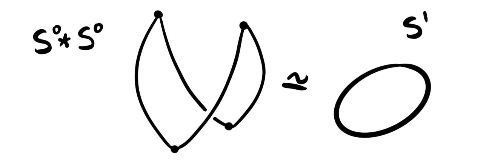
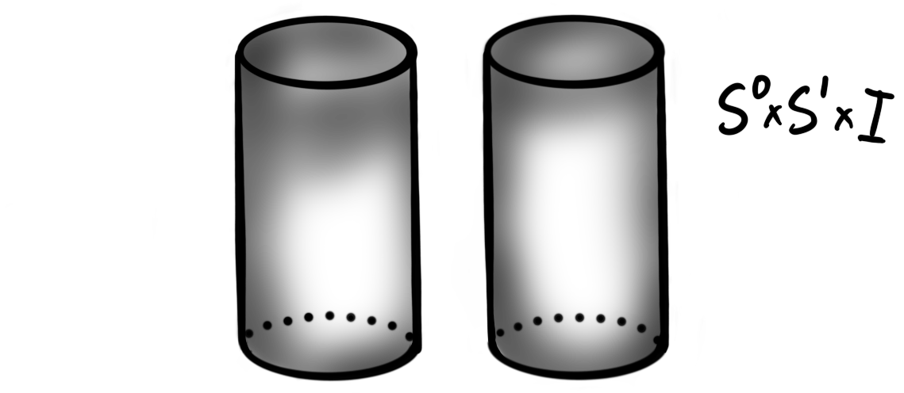

In the [previous post]() we studied some "easy" cases of homotopy groups of spheres. We focused most on the group $\pi_3(S^2)$ and its computation from the Hopf fibration. All groups calculated last time were part of the so-called unstable range, meaning that they are not invariant under suspension. Due to the Freudenthal suspension theorem we know precicely the stable range for homotopy groups of spheres, and these are given by the stable homotopy groups. These groups are what we will look at today (and what we looked at during the second part of the talk these two blog-posts are based upon). We will compute some of the low stable homotopy groups of spheres using the socalled $J$-homomorphism. But, in order to do this calculation we must cover a plethora of interesting mathematics. 

We have already looked at [stable homotopy groups](), but let's recall the definition anyway. 

 **Definition:**  The $k$'th stable homotopy group of the spheres is defined as 

$$\pi_k^S=colim_n(\pi_{k+n}(S^n))$$

We know that this stabilizes in finite steps due to the Freudenthal suspension theorem. 

When we look at a table of the homotopy groups of spheres, we find these stable groups along the diagonals, and the stable range is below the jagged line. 

<!--- 
|   |1    |2    |3    |   4 |   5 |
--- | --- | --- | --- | --- | --- |
|$S^1$|$\Z$|$0$|$0$|$0$|$0$|
|$S^2$|$0$|$\Z$|$\Z$|$\Z/2$|$\Z/2$|
|$S^3$|$0$|$0$|$\Z$|$\Z/2$|$\Z/2$|
|$S^4$|$0$|$0$|$0$|$\Z$|$\Z/2$|
|$S^5$|$0$|$0$|$0$|$0$|$\Z$|
--->

From the table we can see what the zero'th and the first stable homotopy groups is. We have in fact already calculated the zero'th stable homotopy group last time, namely $\pi_0^S=\Z$, and [last year we calculated]() $\pi_4(S^3) = \Z/2$, which we now see is in the stable range. Hence we actually know two stable homotopy groups of spheres. But, how do we find some of the other ones? 

## The $J$-homomorphism

If you have ever studied a table of the homotopy groups of spheres, you will maybe start to see some weak patterns, in particular some repeating behaviour. One of these repeating behaviours comes precisely from the $J$-homomorphism, which is a group homomorphism from the homotopy groups of the infinite orthogonal group to the stable homotopy groups of spheres. 

 **Definition:**  The space $O(n)$, called the $n$'th orthogonal group, is the set of orthogonal $n\times n$ matrices, i.e. 

$$O(n) = \\{A\in M(n):AA^T = I = A^TA\\}$$

It can also be thought of as the space of distance preserving transformations of $\R^n$, or more relevant for us, as the symmetry group of the $(n-1)$-sphere. We are not so much interested in the group structure on $O(n)$, but merely its topological properties. It is in fact a Lie group, which in particular means it is a manifold. 

Since $O(n)$ form the symmetries of the $(n-1)$-sphere, an element $a\in O(n)$ can be thought of as a map $a:S^{n-1}\longrightarrow S^{n-1}$. If we now consider the $k$'th homotopy group $\pi_k(O(n))$ we can think of an element in this group as being represented by a map 

$$S^k\longrightarrow Map(S^{n-1}, S^{n-1})$$

or by the Hom-Tensor adjunction a map 

$$S^k\times S^{n-1}\longrightarrow S^{n-1}.$$

There is a topological construction — called the Hopf construction — that takes a map from a product $X\times Y\longrightarrow Z$, and creates a map $X\star Y\longrightarrow \Sigma Z$, where $X\star Y$ is the *join* of $X$ and $Y$. The join of two spaces is a construction we don't use very often, but it is a constructed from $X\times Y\times I$ by collapsing one end to $X$ and one end to $Y$. By "end" we mean the sets $X\times Y\times \{0\}$ and $X\times Y\times \{1\}$, i.e. at the endpoints of the interval $I$. The most used example and visual for the join of two spaces is the join of two intervals, $X=I=Y$. Then we get the following space $I\star I$: 

Let's try to see what happens for the spheres. To be able to draw these, we must restrict ourselves to only $S^0\star S^0$ and $S^0\star S^1$, but hopefully this will be instructive enough. When constructing the space $S^0\star S^0$ we first construct $S^0\times S^0 \times I$. The space $S^0\times S^0$ consists of four disjoint points

and when we take the product with $I$ we then get four disjoint copies of $I$:

Collapsing one side to $S^0 = \\{x_1, x_2\\}$, and the other to $S^0=\\{y_1, y_2\\}$ we get

which we see we can topologically deform to $S^1$. Hence, $S^0\star S^0 \simeq S^1$. For $S^0\star S^1$ we start with $S^0\times S^1$, which is just two copies of $S^1$. Then taking the product with $I$ gives us two disjoint cylinders: 

Collapsing first one side to $S^0$ and then the other to $S^1$ we get

which we see we can deform into $S^2$. This happens in general for all spheres, and we do in fact have $S^n\star S^m \simeq S^{n+m+1}$. So, when we apply the Hopf construction to our map $S^k\times S^{n-1}\longrightarrow S^{n-1}$ representing an element in $\pi_k(O(n))$, we get a map

$$S^{k+n}\cong S^k\star S^{n-1} \longrightarrow \Sigma S^{n-1}\cong S^n$$

which is a representative for an element in $\pi_{k+n}(S^n)$. Sending a homotopy class of a representative in $\pi_k(O(n))$ to the homotopy class in $\pi_{k+n}(S^n)$ given by this construction described above gives a group homomorphism

$$J_k:\pi_k(O(n))\longrightarrow \pi_{k+n}(S^n)$$

which is the so-called $J$-homomorphism. We will use this homomorphism to produce subgroups of $\pi_k^S$, but first we need to stabilize, i.e. let $n$ go to infinity. But how do we do this with $O(n)$?

## The infinite orthogonal group

The first thing to notice is that the $(n-1)$-sphere embeds into the $n$-sphere by thinking of it as the equator. For $n=2$ this looks like the following picture: 

Recall that $O(n)$ is the symmetries of the $(n-1)$-sphere, hence if we think of the symmetries of the $(n-1)$-sphere as being the symmetries of the $n$-sphere that only acts on the equator, then we can think of $O(n)$ as a subspace of $O(n+1)$. Hence we get a nested inclusion 

$$O(1)\subset O(2)\subset O(3)\subset \cdots \subset O(n)\subset \cdots \subset O(\infty) = \bigcup_{n=1}^\infty O(n)$$

The space at the end, $O(\infty)$ is called the infinite orthogonal group, and it is in fact the colimit of the $n$'th orthogonal groups, just as in the sequence above. Taking colimits of the $J$-homomorphism we get homomorphisms

$$J_k:colim_n\pi_k(O(n))\longrightarrow colim_n\pi_{k+n}(S^n)$$

We have $colim_n\pi_k(O(n)) \cong \pi_k(colim_nO(n)) \cong \pi_k(O(\infty))$ and by definition $colim_n\pi_{k+n}(S^n) = \pi_k^S$, hence we get a homomorphism

$$J_k: \pi_k(O(\infty))\longrightarrow \pi_k^S$$

called the stable $J$-homomorphism. This is a group homomorphism from the unstable homotopy groups of the infinite orthogonal group, to the stable homotopy groups of the spheres. So why is this morphism important? We do in fact completely know the homotopy groups of $O(\infty)$, so having this map will give us calculable information about the stable homotopy groups of the spheres! 

### Bott periodicity

The result that tells us what the homotopy groups of $O(\infty$) are is called Bott periodicity. As the name suggests, this is a result about the periodicity of these homotopy groups. This means that if we know the groups for small $n$, we know the groups for all $n$ due to their periodic nature. The bott periodicity result can be summarized in an very short equation:

$$\Omega^8 O(\infty) \simeq O(\infty).$$

In words: The eightfold loop space of the infinite orthogonal group is again homotopy equivalent to the infinite orthogonal group. This means in particular that we have homotopy groups with a periodicity of eight (because homotopy equivalent spaces have equivalent homotopy groups, and taking loop spaces just shifts the degree), i.e.

$$\pi_k(O(\infty)) \cong \pi_{k+8}(\Omega^8 O(\infty))\cong \pi_{k+8}(O(\infty)).$$

So in order to know them all we only need to list eight of them. These eight are:

$$\begin{aligned}%
\pi_0(O(\infty)) &\cong \Z/2 \\\\ %
\pi_1(O(\infty)) &\cong \Z/2 \\\\ %
\pi_2(O(\infty)) &\cong 0 \\\\ %
\pi_3(O(\infty)) &\cong \Z \\\\ %
\pi_4(O(\infty)) &\cong 0 \\\\ %
\pi_5(O(\infty)) &\cong 0 \\\\ %
\pi_6(O(\infty)) &\cong 0 \\\\ %
\pi_7(O(\infty)) &\cong \Z %
\end{aligned}$$

which you can remember by singing them to the tune of "Twinkle, twinkle little star". Under the stable $J$-homomorphism these groups gets sent to subgroups of the stable homotopy groups of spheres, which means that the collection of stable homotopy groups of spheres admit an eightfold periodicity. In order to use these to actually calculate some stable homotopy groups of spheres, we need to know what these subgroups are, i.e. what the image of the $J$-homomorphism is. 

## The image of the $J$-homomorphism

Luckily for us, Adams described these groups in the 60's, using a conjectured result (called the Adams conjecture) later proved by Quillen. Hence the following theorem is usually credited to them both. 

 **Theorem (Adams-Quillen):**  Let $k>0$. The image of the $J$-homomorphism, $ImJ_k$ is given by 

- $0$ when $k=2,4,5,6 \,(mod\,8)$ and
- a cyclic group or order $2$ when $k= 0,1 \,(mod\, 8)$.
- If $k=3,7 \,(mod\,8)$ then $k=4r-1$. The image $ImJ_k$ is given by a cyclic group of order equal to the denominator of $B_{2r}/4r$, where $B_{r}$ is the $r$'th Bernoulli number.

The incredible part of this theorem is of-course the last point. Somehow the Bernoulli numbers, which are more commonly found in analysis and number theory, show up in the homotopy groups of spheres. The reason they show up is linked to the reason that the Bernoulli numbers show up among diffeomorphism classes of exotic spheres, due to Milnor and Kervaire. We will get to this in a bit, but first: Due to the Bernoulli numbers being related to the Riemann zeta function $\zeta(z)$, we can write that the image of the $J$-homomorphism for $k=4r-1$ is given by a cyclic group or order $S$, where

$$S = \text{denominator}(\zeta(1-2r)/2).$$

This is the first — and probably the last — time the Riemann zeta function is making an appearance on this blog, so we felt an obligation to include it. 

But, as you may have noticed, the image of the $J$-homomorphism only gives us subgroups of the stable homotopy groups of spheres. It would then be interesting to know if these subgroups are actually the entire group. So we ask, does this happen? And if it does, then when? The answer to the former is yes, and the latter is complicated... Knowing if $ImJ_k$ is the entire $k$'th stable homotopy group is the same as knowing wether $\pi_k^S/ImJ_k$  is trivial. By some mathematical magic, this quotient groups can be described by another quotient group — the quotient of the group of $h$-cobordism classes of the spheres by the subgroup of manifolds that are the boundaries of a higher dimensional paralellizable manifold. Let's define these terms. 

Recall that we have talked a bit about [cobordisms before](). These give a very general and weak equivalence relation between manifolds. A cobordism between two manifolds can be thought of as being a way to deform one space into the other, except we allow the deformation to be non-continuous at finitely many discrete points. More specifically, a cobordism is another smooth manifold that has the disjoint union of the two original manifolds as its boundary. 

 **Definition:**  Let $M$ and $N$ be smooth $n$-manifolds. A cobordism $W:M\longrightarrow N$ is a smooth $n+1$ dimensional manifold $W$ such that $\partial W = M\coprod N$. We call $W$ an $h$-cobordism if the inclusions $M\hookrightarrow W$ and $N\hookrightarrow W$ are both homotopy equivalences. If $M$ and $N$ are smooth manifolds such that there exists an $h$-cobordism between them, we say they are $h$-cobordant. 

An $h$-cobordism can be visualized as something like: 

We see that a cylinder between two manifolds is an $h$-cobordism, and we can wonder wether these are the only ones. This leads to the $h$-cobordism theorem, an infamous and important result, proved by Stephen Smale in the 60's. 

 **Theorem (Smale):**  Let $W:M\longrightarrow N$ be a compact $h$-cobordism between two simply connected smooth manifolds of dimension at least $5$. Then $W$ is diffeomorphic to a cylinder $M\times I$. 

By Donaldson we know that this theorem does not hold for smooth manifolds of dimension $4$, but it does hold in dimension $3$, as it is equivalent to the Poincaré conjecture, proved in 2003 by Perelman. It also is trivially true in dimension $2$ and $1$. Hence the $h$-cobordism theorem holds for all $n\neq 4$. 

Since the spheres are simply connected, we see that all manifolds that are $h$-cobordant to sphere, must itself be a sphere. The $h$-cobordisms must in some way preserve the smooth structures on these spheres, meaning that for high $n$ — where there exists exotic spheres — we can get several $h$-cobordism classes of spheres. In fact, the set of $h$-cobordism classes of $n$-spheres is equivalent to the set of smooth structures on the $n$-sphere. At least for $n\neq 4$, as for this dimension it is an open problem whether exotic spheres exists. 

The $h$-cobordism classes of spheres form a group under disjoint union, denoted $\Theta_n$, and (for $n\neq 4$) the set of smooth structures on $S^n$ form a group under connected sum. The equivalence between their sets respects these group structures, so we do in fact have a group isomorphism between the group of smooth structures on $S^n$  and $\Theta_n$. 

By Milnor and Kervaire we know some of the dimensions that do and do not have exotic spheres. This we now know gives us the structure of the group $\Theta_n$. In particular we know that $\Theta_n \cong 0$ for $n= 1,2,3,5,6$, as these dimensions have no exotic spheres. We do also in fact know that $\Theta_4\cong 0$, but not due to this argument based on smooth structures on spheres. 

Ok, so why do we care about these complicated — but also trivial — groups. It is because of the following injective homomorphism:

$$\Theta_k/bP_{k+1} \longrightarrow \pi_k^S/ImJ_k$$

Here $bP_{k+1}$ is the cyclic subgroup of spheres that are the boundary of a parallelizable manifold. As we are only interested in the above cases where $\Theta_n \cong 0$ we don't really need to understand this subgroup. But, we will mention that this is where the Bernoulli numbers show up, namely as the order of this cyclic subgroup $bP_{k+1}$. The important part is that since the homomorphism is injective and the even more importanter part is that we know precisely when this injective group homomorphism is an isomorphism. It is an isomorphism when $k$ is an integer such that there is no $k$-manifold that has Kervaire invariant equal to $1$. If there is a manifold with Kervaire invariant one, then the image of the homomorphism is a subgroup of index $2$.

This blog post is already getting too long, so we will not cover the Kervaire invariant one problem in detail. We will however say that it is an invariant that measures wether a manifold can be cut up and surgically sewn together into a sphere. If such a surgery is possible then the manifold has Kervaire invariant zero, but if it is impossible it has invariant one. Finding the dimensions which have manifolds with Kervaire invariant one is an almost completely solved problem. We know there exists such manifolds in dimensions $n=2,6,14,30,62$ and possibly (still open question) in dimension $126$. Now we can finally calculate some stable homotopy groups of spheres! 

## Finally some calculation

We now have our tools and our results, so the only thing remaining is putting them together to form calculations on the stable homotopy groups we were after. As you might barely recall, this blog-post is about homotopy groups of spheres, even though it might not feel like it... Anyway, lets start with $\pi_1^S$. 

$$\Large \cdots \pi_1^S \cdots $$

As we know that $\Theta_1 \cong 0$ and that there is no $1$-manifold with Kervaire invariant $1$, we know that the group $\pi_1^S/ImJ_1\cong 0$, i.e. that the image of the $J$-homomorphism is the entire group $\pi_1^S$. For $k = 1 \,(mod\,8)$ we know that $J(\pi_k(O(\infty)))$ is a cyclic group of order $2$, meaning that $\pi_1^S \cong ImJ_1 \cong \Z/2.$ We did alredy know this, as we calculated $\pi_4(S^3)$ [last year]() which lies in the stable range, but now we have a separate proof, which is always nice to have.  

$$\Large \cdots \pi_2^S \cdots $$

For $k=2 \,(mod\,8)$ we know that $ImJ_k =0$. Also, in dimension $2$ we have a manifold with Kervaire invariant one. This means that our injective map

$$\Theta_2/bP_3 \cong 0 \longrightarrow \pi_2^S/ImJ_2 \cong \pi_2^S$$

has index $2$, i.e. that $\pi_2^S$ must be a group of order $2$. Thus, $\pi_2^S \cong \Z/2$. 

$$\Large \cdots \pi_3^S \cdots $$

We now have the interesting case that $k=3\,(mod\,8)$, meaning that $k=4r-1$ for $r=1$. This means that the image of the $J$-homomorphism is a cyclic group of order $\text{denominator}(B_{2}/4)$. The second Bernoulli number $B_2$ is $1/6$, meaning that we have a cyclic group of order $6\cdot 4=24$. The group $\Theta_3$ is still trivial, and there is no $3$-manifold with Kervaire invariant one, meaning that we again know that $ImJ_3 \cong \pi_3^S$. This means that we have $\pi_3^S \cong \Z/24.$ This is the first truly weird stable homotopy group in our opinion.

$$\Large \cdots \pi_4^S = \pi_5^S \cdots $$

For both these groups we have no manifolds with Kervaire invariant one, and still $\Theta_4 \cong \Theta_5 \cong 0.$ This means that the image of the $J$-homomorphisms gives the entire groups $\pi_4^S$ and $\pi_5^S$. But, the group $\pi_4(O(\infty)) \cong 0 \cong \pi_5(O(\infty))$, hence the image of the $J$-homomorphisms are trivial, which means we have $\pi_4^S \cong 0 \cong \pi_5^S$. 

$$\Large \cdots \pi_6^S \cdots $$

This is the last group we are going to calculate. We could have gone further, but at dimension seven we run into exotic spheres, making things more complicated.. For $k=6$ we have manifolds with Kervaire invariant one, meaning that the map 

$$\Theta_6/bP_7 \cong 0 \longrightarrow \pi_6^S/ImJ_6$$

has index $2$. The image of the $J$-homomorphism is trivial, because $\pi_6(O(\infty))\cong 0$, hence by the same reasoning as for $\pi_2^S$, we get $\pi_6^S \cong \Z/2.$

This rounds up our looong post about the stable homotopy groups of the spheres. I was not this detailed in describing and defining everything in my talk (which these two twin posts are based on), but I wanted to have some proper definitions and calculations when actually putting this to the public. Calculating these groups is fun, but I think we stop here for now. Maybe some other time we will describe how we have actually just described pieces of the lowest chromatic homotopy layer of the sphere spectrum, maybe we wont...