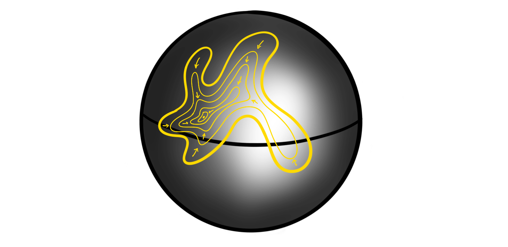
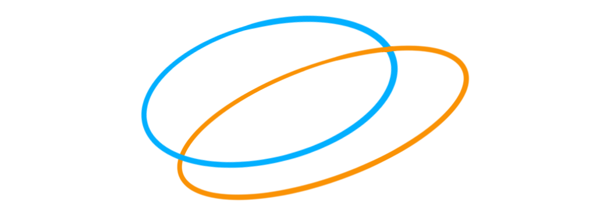
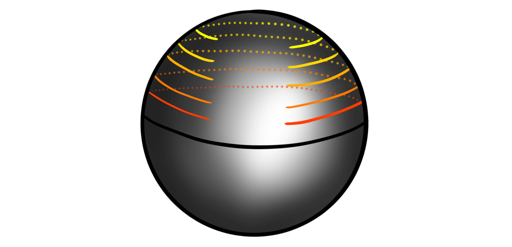

Recently I gave a talk about the homotopy groups of spheres, and as usual, I try to collect my thoughts on this blog before (or after) presenting. The homotopy groups of spheres have featured several times on this blog, and we have made some effort into calculating them for some small dimensions. In the talk I wanted to showcase some methods used to calculate these groups, as well as doing some of the "calculations". We have met several of the tools before, like the long exact sequence from a fibration and the Freudenthal suspension theorem, but we will also meet some new ones, like the $J$-homomorphism and the $h$-cobordism group. These two are methods for calculating the stable homotopy groups of spheres, or at least some of their subgroups. For the low dimensional cases, these subgroups will luckily be the entire groups. Due to the length of the post I have split it into two: one covering the unstable homotopy groups, mostly focusing on the Hopf fibration, and one covering the stable groups, mostly focusing on the image of the $J$-homomorphism. Before we start we recall the definition of the homotopy groups of spheres. 

 **Definition:**  Let $m$'th homotopy group of the $n$'sphere is defined to be the set of homotopy classes of pointed continuous maps $S^m\longrightarrow S^n$ , denoted $$\pi_m(S^n)=[S^m, S^n].$$ 

### Motivation

Before doing anything at all we should motivate why these groups are interesting to study, and why mathematicians throughout the last 120 years have spent considerable effort into trying to understand them and their related theory. 

The main thing we want to study in homotopy theory are the sets $[Y, X]$ of homotopy classes of continuous maps between topological spaces. We can simplify a bit and consider based maps instead, as these are the ones most relevant for homotopy. Both (co)homology theory and homotopy theory can be built out from studying them on CW complexes instead of general topological spaces. These are spaces built by attaching cells of different dimensions to each other by specified attaching maps. Any topological space $X$ has a CW approximation $\widetilde{X}$, in the sense that $\widetilde{X}$ is a CW complex and that there is a weak homotopy equivalence $\widetilde{X}\longrightarrow X$. This is because the CW complexes are the cofibrant objects in the category of topological spaces with the Serre model structure, hence any topological space has a cofibrant replacement, i.e. a CW complex weakly equivalent to it. This is explained in more detail in the [fibration series](). Anyway.. We can build these CW complexes using categorical colimits of spheres and disks. If we allow ourselves to use more homotopical language, we can instead use just spheres and points when instead using homotopy colimits. This is because disks are contractible, and homotopy comlimits are not changed by using homotopy equivalent objects. Maps out of a homotopy colimit commute with taking homotopy classes of maps, so we can simplify studying all sets $[Y, X]$ by studying the sets of maps out of the components making up $Y$, namely spheres. Hence we can study the sets $[S^n, X]$ in order to still have a very good understanding of all homotopy classes of maps. But these are nothing less than the definition of the homotopy groups of $X$! Hence the study of homotopy theory largely relies on studying homotopy groups of spaces. 

Unfortunately, maps into a homotopy colimit does not well depend on the maps into each component, so we cant reduce this nicely into just studying the homotopy groups of spheres. So to motivate why we do that we usually say that we want to consider the homotopy groups on some nice spaces we think we understand. At least this is probably how it was motivated historically as some of the first ever examples calculated was the homotopy groups of some low dimensional spheres. 

A more modern motivation for studying homotopy groups of spheres — at least the stable ones — is that they coincide with the framed cobordism groups of manifolds by the Pontrjagin-Thom construction. Hence the homotopy groups of spheres "knows about" geometric topology and all its secrets. 

### The first examples

The first example one meets is always the fundamental group of the circle, $\pi_1(S^1)$. This can be seen to be equal to the integers $\Z$ by defining $$S^1 = \\{z\in \mathbb{C} : |z|=1\\},$$ i.e. the norm one complex numbers. The fundamental group is then homotopy classes of pointed maps $S^1\longrightarrow S^1$. One such map is defined by $z\longmapsto z^n$ for some integer $n\in \Z$. This map can be thought of as winding $S^1$ around itself $n$ times. Such a map exists for any integer, at it can be shown that any map $S^1\longrightarrow S^1$ is homotopic to one of these maps. Hence $\pi_1(S^1)$ is in bijection with integers $n,$ i.e. $\pi_1(S^1)\cong \Z$. For readers having seen some differential topology, we can also use the notion of degree to prove this. They correspond in this example, but using degrees generalizes more nicely to all dimensions. But we don't need that as we proved in a [recent post]() about the Freudenthal suspension theorem that we in fact have $\pi_{i+1}(S^{i+1})\cong \pi_i(S^i)$, hence we now know that $\pi_n(S^n)\cong \Z$ for all $n$. 

What about going one dimension up — to the fundamental group of the sphere, $\pi_1(S^2)$? Intuitively, we can show that this is the trivial group by showing that any based loop on $S^2$, i.e. a pointed continuous map $S^1\longrightarrow S^2$ representing a class in $\pi_1(S^2)$, is contractible, i.e. homotopic to the constant map on the basepoint. We illustrate this by a drawing as a substitute for a rigorous proof: 

This shrinking of loops to points holds in general for all spheres $S^n$ with $n\geq 2$, hence all the higher dimensional spheres have trivial fundamental groups: $\pi_1(S^n)\cong 0$ for $n\geq 2$. What one historically suspected was that the homotopy groups of the spheres were the same as the homology groups of the spheres, i.e. concentrated in their singular dimension. But, as Hopf revealed, this is not the case. Hopf found a non-trivial map (in the sense that it is not homotopic to a constant map) $\eta:S^3\longrightarrow S^2$, which proved the existence of non-trivial homotopy groups of spheres. We have in fact already covered this computation, as we showed that $\pi_3(S^2)\cong \Z$ by using the [long exact sequence of homotopy groups from a fibration](). This time around I want to be more graphical, and more "true" to Hopf's original proof. We wont be as highly detailed and rigorous of course... 

### The Hopf fibration

The fist thing we need to do is define the map. There are several ways to do this, but the simplest one is by thinking about $S^3$ as the unit sphere in $\mathbb{C}^2$, i.e. the complex tuples $(z_1, z_2)$ such that $|z_1|^2+|z_2|^2 = 1$. Similarly we think of $S^2$ as the "unit sphere" in $\mathbb{C}\times \mathbb{R}$, i.e. the tuples $(z, x)$ such that $|z|^2+x^2 = 1$. We can then define the Hopf fibration $\eta$ by 

$$\eta(z_1, z_2) = (2z_1 \overline{z_2}, |z_1|^2-|z_2|^2)$$

where $\overline{z_2}$ denotes complex conjugation. The points in the image of this map do in fact lie on $S^2$ as we have 

$$|2z_1\overline{z_2}|^2+(|z_2|^2-|z_2|^2)^2 = (|z_1|^2+|z_2|^2)^2 = 1.$$

So, how can we show — or at least motivate — that this map is not homotopic to a constant map? What Hopf did was to define an invariant, which we now call the Hopf invariant. This he showed was a homotopy invariant of a map, i.e. that all maps in a homotopy class have the same Hopf invariant. If we then show that a constant map and the Hopf fibration have different Hopf invariants, then they can't be homotopic! This is the overall strategy. The next question is then: what is the Hopf invariant? 

Let's study the fibers of $\eta$. one can show that two points $(z_1, z_2)$ and $(w_1, w_2)$ on $S^3$ gets sent to the same point $(z,x)$ under $\eta$ if and only if there is a complex number $\alpha$ with $|\alpha|=1$, such that $(z_1, z_2)=(\alpha w_1, \alpha w_2)$. Because $\alpha$ must have unit length, they form the unit circle in the complex plane. This means that if we multiply a point on $S^3$ by a point on $S^1$ (interpreted the correct way), we still get sent to the same point on $S^2$. Another way to say this is that the fiber of a point on $S^2$ is a circle. This justifies the more classical formulation of $\eta$:

$$S^1\longrightarrow S^2\overset{\eta}\longrightarrow S^2.$$

If we now look at a circle $C$ on $S^2$ that is parallel to the equator

then its preimage $\eta^{-1}(C)$ should be a torus in $S^3$. This is because we have a fiber $S^1$ for each point in $S^1$ – a circle of circles – also called a torus. We can stereographically project this torus in $S^3$ to $\mathbb{R}^3$, giving us the normal torus that we all know and love. If we pick some point $c\in C$, then how does the corresponding circle $\eta^{-1}(\\{c\\})$ look inside this torus  $\eta^{-1}(C)$? These circles turn out to be Villarceau circles:

This means that our tori in $S^3$ are sewn together by these "diagonal" circles! If we choose two distinct points $c_1$ and $c_2$ on $C$, what can we say about their corresponding two circles $\eta^{-1}(\\{c_1\\})$ and $\eta^{-1}(\\{c_2\\})$? They look like this: 

On first glance this looks just like two circles on a torus, but if we remove the torus for a moment we can recognize the two circles as forming a Hopf link! 

This link has a non-trivial linking number $l$, namely $l=1$. This linking number is what we define to be the Hopf invariant $h$ of $\eta$, i.e. $$h(\eta)= l(\eta^{-1}(\\{c_1\\}), \eta^{-1}(\\{c_2\\}))=1.$$ 

For a general map $S^3\longrightarrow S^2$ the preimage of a point in $S^2$ is some link (a collection of possibly knotted knots) in $S^3$. The preimage of two points is then two such links, and the Hopf invariant is the linking number of these links. Hopf's magic was to show that this linking number is a homotopy invariant. We won't cover this here, but this is the real meat of why the Hopf fibration is a non-trivial map. We do note that there is a more standard definition of the Hopf invariant using cohomology, but this should be equivalent. We can form a map such that its Hopf invariant is $n$ for any $n\in \Z$, hence the third homotopy group of the sphere, $\pi_3(S^2)$ is in bijection with the Hopf invariants, which means that $$\pi_3(S^2) \cong \Z.$$ The generator for the group is the homotopy class of the Hopf fibration, $[\eta]$, which means that it is sort of the archetypal non-trivial map from $S^3$ to $S^2$.  

The fact that the Hopf fibration has Hopf invariant $1$ is rather special, as this feature for maps between spheres is incredibly rare. In fact, it only happens for spheres that are the unit length vectors of a finite dimensional real division algebra, which there are only four of: $\mathbb{R}$, $\mathbb{C}$, $\mathbb{H}$ and $\mathbb{O}$. This is the result of the famous Hopf invariant one problem, solved by Adams in 1960. 

Those who have already seen images of the Hopf fibration have probably already seen the fantastic [visualization video](https://www.youtube.com/watch?v=AKotMPGFJYk&t=155s) video by Niles Johnson. In the video we can clearly see the toric nature of the linked circles. One thing he shows is how preimages of different parallel circles forms nested tori, kind of like the following:

which is an attempt to draw roughly the preimage of five truncated circles, like these

Go watch the video (and Niles [explanation of it](https://nilesjohnson.net/hopf.html)) for some more excellent visualization and intuition for how the Hopf fibration works. More exploration of the Hopf fibration should probably be its own blog post, but for now this will have to do.. 

### Part two

In another [blog post]() we computed the fourth homotopy group of the $3$-sphere, $\pi_4(S^3)\cong \Z/2$. This calculation used a wide array of techniques and side-steps, but is a nice comprehensive calculation. But, this is as far as I know how to compute properly (without handwaving so hard my hands fall off) the homotopy groups of spheres in the so-called unstable range. We can suspend the Hopf map or calculate some stuff from generalized Hopf fibrations, but I don't think I can properly complete a calculation using these methods properly. The plan was to then leave the unstable range and move on to the $J$-homomorphism. This allows us to calculate a couple of the lower stable homotopy group of the spheres. But, I see that this post has become long enough already. We therefore split it into two parts. The next one will therefore feature only stable homotopy groups, so perhaps it is nice and natural to have a split here anyway!