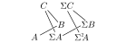

For the last five years mathematics has been my passion, as well as my main focus in life. This passion for mathematics will hopefully not diminish, as I am now heading into four more years of studies and research through a PhD in mathematics at NTNU. I am joining a project, called Tensor triangulated geometry in Trondheim, so today I thought I would explore the definition of one of the main players in this theory, namely tensor triangulated categories. We have already met half of this structure during our several encounters of [monoidal categories](), but the other half remains, as well as how to glue them together into a cohesive joint structure. 

## Triangulated categories

As you may guess, a tensor triangulated category has both the structure of a tensor category, and a triangulated category. The tensor structure is the one we have met before, through monoidal categories, but the triangulated structure we have not yet explored in our mathematical endeavors on this blog. So, lets change that fact. 

To justify it's name, triangulated categories should have something to do with triangles. The way these triangles enter the picture is maybe not as direct as one would want, but they nonetheless feature prominently enough to give its name. One way to motivate triangulated categories, is to seek to generalize  two concepts into a common framework. These two things are:

- Exact sequences from homological algebra
- Fiber and cofiber sequences from homotopy theory

Bear in mind that the following discussion is a bit rough, but that this is in order to compare similarities in algebra and topology. 

An exact sequence consists of three abelian groups $A, B, C$ together with group homomorphisms $f:A\longrightarrow B$ and $g:B\longrightarrow C$ such that $f$ is injective and $\ker g \cong \text{im}f$. We usually denote such a sequence by 

$$A\overset{f}\longrightarrow B \overset{g}\longrightarrow C$$

More generally we can construct such sequences in any Abelian category, as in such categories we always have nicely behaved kernels and cokernels. Of particular interest is the fact that $C\cong B/f(A).$ On the other hand, a cofiber sequence consists of three topological spaces $A, B, C$ together with maps $f:A\longrightarrow B$ and $g:B\longrightarrow C$, such that $f$ is a cofibration and $C$ is the mapping cone of $f.$ It is more often denoted

$$A \overset{f}\longrightarrow B\overset{g}\longrightarrow  C(f).$$

We covered fibrations quite extensively in the [the fibration series](), so look there for a more in depth review of their theory and their generalization into model categories. In said series we covered cofibrations only a little bit, but we noted in the post about [cofibrations]() that the mapping cone $C\simeq C(f)$ of a cofibration is homotopy equivalent to $B/f(A)$. This is the same as the above situation with abelian groups. 

Ok, so how do we generalize these into a common framework? When we looked a cofibrations and cofiber sequences in the fibration series, we constructed a longer sequence of topological spaces from each cofiber sequence. We expanded the cofiber sequence into 

$$A \overset{f}\longrightarrow B\longrightarrow  C(f)\longrightarrow \Sigma A, $$

where $\Sigma A$ is the suspension of $A$. For fibrations we did this in the opposite direction, i.e. constructed the mapping fiber (homotopy fiber), and a map from the loop space into it to get a sequence

$$\Omega B \longrightarrow F(f)\longrightarrow A\overset{f}\longrightarrow B.$$

If we extend the case of abelian groups to chain complexes of Abelian groups, or chain complexes of objects in an Abelian category in general, then we can also for any morphism of chain complexes $f:A\longrightarrow B$ construct a cone $C(f)$ to get a sequence

$$A\longrightarrow B\longrightarrow C(f).$$

This can also be extended into a longer sequence 

$$A\longrightarrow B\longrightarrow C(f)\longrightarrow A[1]$$

where $A[1]$ denotes the shifted complex of $A$. These two situation look awfully similar, and this is exactly what we use to generalize into a categorical structure. 

Before we reveal the definition of a triangulated category, we define what we mean by a triangle. Let $T$ be an additive category equipped with an additive automorphism $\Sigma:T\longrightarrow T$ (algebraists often write $(-)[1]$ for this functor instead). A triangle is a tuple $(A, B, C, f, g, h)$ in $T$ consisting of objects $A, B, C$ and morphisms $f:A\longrightarrow B$, $g:B\longrightarrow C$ and $h:C\longrightarrow \Sigma A$. It is often denoted simply by 

$$A \overset{f}\longrightarrow B\overset{g}\longrightarrow  C\overset{h}\longrightarrow \Sigma A$$

We now maybe see why these are called triangles, as these almost form a triangle of objects and morphisms. If the automorphism can be taken to be the identity functor, then we in fact have a triangle:

So our definition of a triangle is a sort of generalization of this image to allow for other automorphisms as well. I don't know if the following image helps, but it is roughly how I visualize and think about triangles

Lets now look at the definition we are interested in. 

 **Definition:**  A *triangulated category* is an additive category $T$, together with an additive automorphism $\Sigma:T\longrightarrow T$ often called the shift, and a class of triangles, $\Delta$, called the exact or sometimes distinguished triangles, such that the following four axioms are satisfied.

This first axiom consist of three parts. 

**TC1.1:** For every object $A\in T$, the triangle 

$$A\overset{id_A}\longrightarrow A\longrightarrow 0\longrightarrow \Sigma A$$

is exact, i.e. is an element of $\Delta$. 

**TC1.2:** Every morphism $f:A\longrightarrow B$ in $T$ can be completed to an exact triangle, i.e. there exists an object $C(f)$—called the cone of $f$—such that 

$$A\longrightarrow B\longrightarrow C(f)\longrightarrow \Sigma A$$

is an exact triangle. 

**TC1.3:** Every triangle

$$A' \overset{f'}\longrightarrow B'\overset{g'}\longrightarrow  C'\overset{h'}\longrightarrow \Sigma A'$$

that is isomorphic to an exact triangle, 

$$A \overset{f}\longrightarrow B\overset{g}\longrightarrow  C\overset{h}\longrightarrow \Sigma A$$

is again exact. Being isomorphic as triangles means that there are isomorphisms $A\rightarrow A'$, $B\rightarrow B'$ and $C\rightarrow C'$ such that the resulting squares commute, i.e. a commutative diagram

We call such diagrams (not requiring the vertical arrows to be isomorphisms) morphisms of triangles. 

**TC2:** If we take an exact triangle

$$A \overset{f}\longrightarrow B\overset{g}\longrightarrow  C\overset{h}\longrightarrow \Sigma A$$

and "rotate" it, i.e. look at the following triangle

$$B\overset{g}\longrightarrow  C\overset{h}\longrightarrow \Sigma A \overset{-\Sigma f}\longrightarrow \Sigma B $$

then this is again exact. The same should hold for a rotation in the other direction, i.e. 

$$\Sigma^{-1}C\overset{-\Sigma^{-1}h}\longrightarrow A \overset{f}\longrightarrow B\overset{g}\longrightarrow  C$$

is again an exact triangle. Notice here that we used the inverse $\Sigma^{-1}$ of $\Sigma$, which exists as it is assumed to be an automorphism. Some authors only require auto-equivalence, which means that there is only a natural transformation from the composition $\Sigma\circ \Sigma^{-1}$ to the identity functor, meaning that the above axiom needs a bit more care and attention. The object $\Sigma^{-1}C$ is called the fiber of $f$. Notice the similarity to the mapping fiber briefly mentioned above, where we had $\Omega$ instead of $\Sigma^{-1}$. The suspension and the loop space functors are not inverses in the normal category of topological spaces, but become so in the homotopy category of spectra, mentioned a bit later. We will do an entire post about these soon. 

**TC3:** Given two exact triangles,

$$A \overset{f}\longrightarrow B\overset{g}\longrightarrow  C\overset{h}\longrightarrow \Sigma A$$

and

$$A' \overset{f'}\longrightarrow B'\overset{g'}\longrightarrow  C'\overset{h'}\longrightarrow \Sigma A'$$

together with morphisms $A\rightarrow A'$ and $B\rightarrow B'$, then there exists a map $\phi:C\longrightarrow C'$ making the diagram

commute. Notice that we do not require this morphism to be unique in general. This is similar to the requirement that we can always complete a morphism into a triangle, just now that we can complete a partial morphism of triangles into an actual morphism of triangles. 

**TC4:** This last axiom is a little more complex than the other three, but it essentially says that we can compose exact triangles into new exact triangles, and that these behave nicely. Take the two exact triangles

$$A \overset{f}\longrightarrow B\overset{g'}\longrightarrow  C'\overset{h'}\longrightarrow \Sigma A$$

and

$$B \overset{g}\longrightarrow C\overset{h}\longrightarrow  A'\overset{f'}\longrightarrow \Sigma B$$

From TC1.2 we know that we can complete the map $g\circ f:A\longrightarrow C$ into an exact triangle

$$A \overset{g\circ f}\longrightarrow C\overset{i}\longrightarrow  B'\overset{j}\longrightarrow \Sigma A.$$

The fourth axiom TC4, states that also the triangle 

$$C'\longrightarrow B'\longrightarrow A'\longrightarrow \Sigma C'$$

needs to be exact. 

If we for a moment interpret these exact triangles as actual exact sequences of groups, then we would have $C'\cong B/A$, $A'\cong C/B$ and $B'\cong C/A$. This last exact triangle then states precisely that we would get

$$B/C\cong A'\cong B'/C' \cong (C/A)/(B/A)$$

also known as the third isomorphism theorem. Hence TC4 is a kind of generalization of the third isomorphism theorem to exact triangles. 

## Examples

Phew... That is always one of the longest definitions to state and understand, and it definitively takes a while to get used to... Hopefully we have explained well enough some of the intuition and connection with groups and topology, which in our opinion really should guide how to think about these categorical structures. The main examples also reflect this. 

The first one is an example where the shift is the identity functor, i.e. $\Sigma A = A$. This example is the category of vector spaces over some field $k$, and the distinguished triangles are any triangle isomorphic to a triangle of the form 

$$A\overset{f}\longrightarrow B \overset{\begin{bmatrix} 0 \\ \pi \end{bmatrix}}\longrightarrow \ker f\oplus \text{cok}\,f \overset{\begin{bmatrix} i \ 0 \end{bmatrix}}\longrightarrow A$$

where $\pi$ is the projection onto the cokernel, and $i$ is the inclusion of the kernel. For a more thorough treatment of this example I recommend my friend Johan's [bachelor thesis](https://fagkom.github.io/posts/mathisen-johan-vik/). In this example we really get a little glimpse of why this structure is named after triangles, as the triangles are the actual diagrams we used for intuition earlier

The next example is the naive homotopy category of the category of chain complexes of modules over some ring $R$, i.e. $HoCh(ModR)$, or more often denoted $K(R)$. This category consists of chain complexes of modules, and the maps are homotopy classes of chain maps. By our discussion of model categories in the [fibration series](), we know that this category is heavily related to $D(R)$ the derived category of $R$. This category is the category of chain complexes of modules over $R$, localized at the collection of quasi-isomorphisms, i.e. the maps that induce isomorphisms in homology. If we take the subcategory of $Ch(ModR)$ consisting of the bifibrant objects in some easily defined model structure, these two categories are equivalent, 

$$HoCh(ModR^{Bif}) \simeq D(R)$$

The third example is the stable homotopy category $hS$. I will go more into detail on this category in another post, as it is important for my future field of study. Its objects can be thought of as the topological equivalent of chain complexes, called spectra. These are sequences of topological spaces, together with certain structure maps, which makes us able to "shift" these sequences using the suspension functor $\Sigma$. We have met one such object in the fibration series, namely the Eilenberg-Maclane spectrum. We used this to represent the singular cohomology functor on topological spaces. This property is in fact a general property of spectra, i.e. that generalized cohomology theory can be represented by a spectrum. This follows from the Brown representability theorem. The distinguished triangles in this category are the triangles of the form

$$A\overset{f}\longrightarrow B \longrightarrow C(f)\longrightarrow \Sigma A$$

where $C(f)$ is the mapping cone of $f$. 

In general, the Quillen homotopy category (the localization at the weak equivalences) of a stable model category (or even more generally a stable $(\infty, 1)$-category) is a triangulated category. A model category is called stable if its initial and terminal object coincide, and every fiber sequence is also a cofiber sequence. Both the derived category of a ring, and the stable homotopy category are examples of this general theory. Maybe we will return to visit this again later as well, as it is rather interesting. 

## The tt-categories

Ok, we now understand a tiny bit about triangulated categories, or at least some intuitive and motivating examples. This post has gotten long enough, so let us finish off by defining the joint tensor and triangulated structure. There are several versions of this structure in the literature, often adding stronger requirements to fit specific needs. 

 **Definition:**  A *tensor triangulated category* (tt-category) is a tuple $(H, \Sigma, \Delta, \otimes, 1, e)$ where $H$ is an additive category, such that 

- $(H, \Sigma, \Delta)$ is a triangulated category
- $(H, \otimes, 1)$ is a symmetric monoidal category
- $e_{X, Y}:(\Sigma A)\otimes B \longrightarrow \Sigma(A\otimes B)$ is a natural isomorphism for all objects $A, B$
- the functors $A\otimes -$  and $-\otimes A$ are additive for all objects $A$
- given a triangle $A\rightarrow B\rightarrow C\rightarrow \Sigma A$ in $\Delta$, then the triangles

$$X\otimes A\longrightarrow X\otimes B \longrightarrow X\otimes C \longrightarrow \Sigma(X\otimes A)$$

and

$$A\otimes X\longrightarrow B\otimes X \longrightarrow C\otimes X \longrightarrow \Sigma(A\otimes X)$$

is in $\Delta$ for all objects $X$, i.e. the functors $X\otimes-$ and $-\otimes X$ preserve distinguished triangles. 

So, there we have it, the combined structure of a tensor category and a triangulated category. This post has gone on long enough, so we wont cover any examples in detail, just mentioning that the stable homotopy category and the naive homotopy category $K(R)$ of a Noetherian ring $R$, are both tt-categories. The most important for us will be the stable homotopy category, which as said earlier we will look more into soon. 

For now this is what I wanted to present, but there will be more posts regarding this theory during the next four years, so follow along if you are interested! I have set a goal to post at least once every month, but there will probably be no regularity in when and what the posts are about. I currently have some vacation time, and thought about making a series defining mathematically what spacetime is. Hopefully this will be a more down to earth and approachable series. I also want to post a summary of my master thesis, which will be my next post I think.