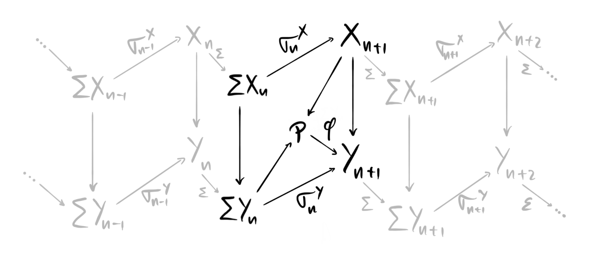

A little while ago we discussed the definition of a [tensor triangulated category](), and in that post we mentioned an example that we didn't explicitly define, namely the stable homotopy category. The goal for todays post is to fix this. There are many ways of defining it, and some are actually better than others. As the name suggests, the stable homotopy category is a homotopy category, which we have discussed before in [the fibration series](). But the question is, what is it the homotopy category of? As we remarked in the post on tensor triangulated categories, it is the homotopy category of the category of spectra, and it is here that the different approaches lie. What exactly is the category of spectra, and which spectra are we even talking about? Is it the sequential spectra? or maybe the orthogonal spectra? or perhaps the symmetric ones? maybe $S$-modules or excisive functors? All these names of course means nothing to us yet, as we haven't properly looked at any of them. We did however meet the $\Omega$-spectrum in an [earlier post](), but which of the above types does it belong to? 

We won't cover all the above today, and most likely never. At least not in full glorious details. When I said that some ways of constructing the stable homotopy category was better than others, what I meant was that some of the above categories of spectra comes with more nice features than the others. The category of sequential spectra — the one we are going to focus on today — is the easiest to grasp, but, it does not come equipped with a nice symmetric monoidal structure, also called tensor structure. As this is one of the two fundamental structures of a tensor triangulated category, we should perhaps be a bit worried about this. We can fix this issue by instead using what is called structured spectra, which the three other types of spectra mentioned above (orthogonal, symmetric and $S$-modules) are versions of. These come nicely equipped with a symmetric monoidal structure, but the spectra themselves are harder to define and understand, as they some equipped with certain group actions or other complicating factors. 

The crucial fact about these different notions of spectra, is that they all come equipped with nice model structures, and to top it all off, their homotopy categories are all equivalent. This means that — from the perspective of homotopy — it does not matter which definition of a spectrum we use. This is why we focus on the simplest one today, namely the category of sequential spectra. 

## Sequential spectra

As we have already seen when looking briefly at $\Omega$-spectra, a spectrum should somehow be a sequence of topological spaces, all connected through certain structure maps. This is still the central idea, and we will see quickly how it related back to the $\Omega$-spectra. As we have [previously covered]() motivation for spectra and why they are interesting, we won't do that here as well, so instead we just jump into the definition. 

 **Definition:**  A *sequential spectrum* $X$ is a sequence of pointed topological spaces[^1] $\{ X_n\}$ for all $n\in \mathbb{N}$ together with pointed continuous maps $\sigma_n^X:\Sigma X_n\longrightarrow X_{n+1}$ called the structure maps. Here $\Sigma$  denotes the reduced suspension functor on the category of pointed topological spaces, $Top_\ast$. 

Since the functor $\Sigma$ has a right adjoint, namely the based loop space functor $\Omega$, we have natural isomorphisms

$$Hom(\Sigma X_n, X_{n+1}) \cong Hom(X_n, \Omega X_{n+1})$$

for all $n$. Hence we could alternatively define the structure maps in the sequential spectra by their adjoint maps, $\widetilde{\sigma} _n^X:X _n\longrightarrow \Omega X _{n+1}$. This is starting to look a lot like the definition we had of an $\Omega$-spectrum last time — the only thing missing is the requirement that this adjoint structure map is a weak homotopy equivalence. So, to be precise we include the definition here as well.

 **Definition:**  A sequential spectrum $X$ is called an $\Omega$*-spectrum* if the adjoint structure maps $\widetilde{\sigma}_n^X$ are weak homotopy equivalences, meaning that they induce isomorphisms on all homotopy groups. 

Let's see some examples. The most fundamental — and hugely important — example is the sphere spectrum $\mathbb{S}$. This is defined by $\mathbb{S}_n = S^n$ and the structure maps being given by the canonical homeomorphisms $\sigma_n:\Sigma S^n \overset{\simeq}\longrightarrow S^{n+1}$. We won't say why in this post, but the sphere spectrum acts among spectra a lot like the integers $\mathbb{Z}$ acts among abelian groups. Stay tuned for more about this in the future as it is rather interesting! Note that the sphere spectrum is not an $\Omega$-spectrum. 

We see that the sphere spectrum is defined by just adding more and more suspensions, so we can generalize this construction into the class of examples called the suspension spectra. For a topological space $X$ we define its suspension spectrum, denoted $\Sigma^\infty X$, by letting $(\Sigma^\infty X)_n = \Sigma^n X$ and defining the structure maps to be the identity. 

The third example we have in fact already seen, namely the Eilenberg-Mac Lane spectrum. We saw this because it is the spectrum that represents singular cohomology theory through the Brown representability theorem. Given a group $G$ we define its Eilenberg-Mac Lane spectrum $HG$ by $(HG)_n= K(G, n)$, where $K(G,n)$ is the $n$'th Eilenberg-Mac Lane space of $G$. The structure maps are given as adjoint structure maps by the canonical homeomorphisms $\widetilde{\sigma}_n:K(G,n)\overset{\simeq}\longrightarrow \Omega K(G, n+1)$. 

Our goal is to make these sequential spectra into a category, specifically a stable model category, and to do that we need to know what maps between spectra should be. 

 **Definition:**  Let $X$ and $Y$ be two sequential spectra. A *map* $f:X\longrightarrow Y$, sometimes also called a morphism or a homomorphism, is a collection of pointed continuous maps $f_n:X_n\longrightarrow Y_n$ commuting with the structure maps in $X$ and $Y$, i.e. 

$$f_{n+1}\circ \sigma_n^X = \sigma_n^Y\circ f_n. $$

We can now define a category, $Sp$, by letting the objects be sequential spectra and the morphisms be maps of spectra. 

## Homotopy groups of spectra

In the introduction we said that the category of sequential spectra $Sp$ has a nice model structure, which — as we know from [the fibration series]() — allows us to study the homotopy theory of spectra. This homotopy theory is called stable homotopy theory. In the previous post on [stable homotopy groups]() we also met this concept of stable homotopy, and it is perhaps not clear yet why the two seemingly different notions coincide. Thus we make this clear before we delve into the model structure. 

Recall that the stable homotopy groups of a topological space $X$ is defined by 

$$\pi_n^S(X) = colim_k \pi_{n+k}(\Sigma^k X).$$

By the Freudenthal suspension theorem this colimit actually exists. To make sense of the connection to sequential spectra we must define homotopy groups of spectra. 

 **Definition:**  Let $X = \{X_n\}$ be a sequential spectrum. We define its $n$'*th homotopy group* to be 

$$\pi_n(X) = colim_k \pi_{n+k}(X_k)$$

Now this is starting to look similar. Recall that we have an assignment that takes a topological space and gives us a spectrum, namely the suspension spectrum. We immediately see that the homotopy groups of a suspension spectrum coincides with the stable homotopy groups of the topological space at its base, i.e. 

$$\pi_n(\Sigma^\infty X) = \pi_n^S(X)$$

which justifies the naming. As an example we see that the homotopy groups of the sphere spectrum gives us the stable homotopy groups of the spheres, i.e. 

$$\pi_n(\mathbb{S}) = \pi_n^S(S_0)$$

Another example is the homotopy groups of the Eilenberg-Mac Lane spectrum of some group $G$. As we maybe expect, we get just one homotopy group, namely the zeroth one. 

$$\pi_n(HG) =  \begin{cases} G, n=0 \\\\ 0, n\neq 0 \end{cases}$$

This is because the Eilenberg-Mac Lane spaces are defined by their unique homotopy group. We see that the homotopy groups of spectra then generalize the stable homotopy groups of topological spaces, which is just what we want. We are after all interested in stable behaviour, and we are trying to stop using topological spaces and instead use spectra.

## The stable model structure

As we have covered [model categories]() earlier we wont do that again here. But, we are interested in a particularly nice type of model category, namely a so-called stable model category. This we must define as we have not yet seen these. 

 **Definition:**  A model category $C$ is said to be *stable* if it has a zero-object $0$, i.e. the initial and terminal object in $C$ is the the same object, and if the induced suspension functor $\Sigma: HoC\longrightarrow HoC$ is an equivalence. 

In a general model category the suspension is defined to be the following homotopy pushout

In order to define a model structure on $Sp$ we need to define three classes of maps: weak equivalences, fibrations and cofibrations. The natural first thing to attempt is to use the model structure on topological spaces. There we already have a nice model structure, called the Serre model structure. Since sequential spectra are built from topological spaces we can try to define a model structure on spectra by using the model structure on their building blocks, for example letting a weak equivalence of spectra be a map $w:X\longrightarrow Y$ such that at each level $w_n:X_n\longrightarrow Y_n$ the map of topological spaces $w_n$ is a weak equivalence, i.e. a map that induces isomorphisms on all homotopy groups. This attempt works perfectly — at least almost. We can let the weak equivalences be the "level-wise" weak equivalences and the fibrations be the "level-wise" fibrations, but we need to fix the cofibrations a bit. We could of course just let them be induced by the two other classes — as being the maps that have the left lifting property with respect to acyclic fibrations — but describing them explicitly will help us when constructing the stable model structure. It is also nicer to know what they are explicitly.

 **Definition:**  We say a map $c:X\longrightarrow Y$ between two sequential spectra $X$ and $Y$ is a *level-wise cofibration* if the map $c_0:X_0\longrightarrow Y_0$ and the maps 

$$X_{n+1}\coprod_{\Sigma X_n} \Sigma Y_n \longrightarrow Y_{n+1}$$

are relative cell retracts, i.e. cofibrations in the Serre model structure on topological spaces. The above maps are the maps we get from the pushout inside the commuting squares defining a map between sequential spectra. Maybe easier to see graphically

where $P$ is the pushout $X_{n+1}\coprod_{\Sigma X_n} \Sigma Y_n$ 

The collections of level-wise weak equivalences, level-wise fibrations and level-wise cofibrations form a model structure on $Sp$ creatively called the level-wise model structure. But, this is not the model structure we want, as it does not make $Sp$ into a stable model category. This means we have to alter it a bit. The precise general method for doing this is called Bousfield localization, and it is a topic we will come back to soon. This is a process for adding more weak equivalences, keeping the cofibrations the same, and thus loosing some of the fibrations. For this post however, we just define each class and call it a day. 

We wanted to incorporate the notion of stable homotopy and this will create the new weak equivalences. We also want our fibrant objects to be the $\Omega$-spectra, so this will determine the fibrations. Let's define each class. 

**Weak equivalences:** The weak equivalences in the stable model structure on $Sp$ are often called the stable weak equivalences to distinguish them from the level-wise model structure briefly discussed above. We say a map of sequential spectra $w:X\longrightarrow Y$ is a stable weak equivalence if it induces isomorphisms $\pi_n(w):\pi_n(X)\longrightarrow \pi_n(Y)$ on all homotopy groups. These are now the homotopy groups of spectra, not topological spaces. Such maps are often called $\pi_\ast$-isomorphisms. 

**Cofibrations:** A map of sequential spectra $c:X\longrightarrow Y$ is called a stable cofibration if it is a level-wise cofibration. These stay the same due to the stable model structure being a Bousfield localization of the level-wise model structure. The cofibrant objects turn out to be CW-spectra — spectra consisting of pointed CW-complexes where the structure maps are inclusions of sub-complexes. 

**Fibrations:** We say a map $f:X\longrightarrow Y$ between two sequential spectra $X$ and $Y$ is a stable fibration if it has the right lifting property with respect to stable acyclic weak equivalences, i.e. the maps that are level-wise cofibrations and $\pi_\ast$-isomorphisms. This is equivalent to defining stable fibrations to be the maps of sequential spectra that are level-wise fibrations, such that for each $n$ the map 

$$X_n\longrightarrow Y_n \prod_{\Omega Y_{n+1}}\Omega X_{n+1}$$

induced by $\widetilde{\sigma}_n^X$ (the adjoint structure maps) and $f$ is a level-wise weak equivalence, i.e. a weak homotopy equivalence. If we let $Y=pt$, then we see that this is equivalent to $X$ being an $\Omega$-spectrum. 

We will not prove that these three classes in fact give a stable model structure — not even just a model structure — as this result is a bit complicated. The important part for us is that the result is true, which means we have a zero object $0$, called the zero spectrum, and that the suspension functor $\Sigma$ is an equivalence on the homotopy category. This homotopy category — obtained by localizing at the stable weak equivalences — is called the stable homotopy category, 

$$HoSp = SHC,$$

i.e. the category in the title of this blog post. This category is very nice and is the natural place to study stable homotopy theory. By the general theory of model categories we have seen before the hom-sets in this category are equivalent to homotopy classes of maps from cofibrant objects to fibrant objects, i.e. from CW-spectra to $\Omega$-spectra. 

There is also a general fact that the homotopy category of a stable model category is always triangulated, hence $SHC$ is a triangulated category! The triangles come from the fiber sequences $F\longrightarrow X\longrightarrow Y$, which due to the stability of the model structure is the same as the cofiber sequences $X\longrightarrow Y \longrightarrow C$. The actual triangles are defined by 

$$X\overset{f}\longrightarrow Y\longrightarrow C(f)\longrightarrow \Sigma X$$

or alternatively as diagrams

where both the left small square is a homotopy pushout, and the big square is a homotopy pushout — hence the right small square is as well. 

As stated earlier, the tensor structure is more complicated, and requires the use of structured spectra. I'm not sure we will cover these, at least not for the moment, as I want to get to other things to write about described below. But, we now have a description of the stable homotopy category $SHC$ as the homotopy category of spectra, which is what we were after. This is a tensor-triangulated category as mentioned, hence why I study it under the project of tensor triangulated geometry for my PhD. 

## Forward

On my list for the future is more stable homotopy theory. I want to describe spectra as an $\infty$-category, describe Bousfield localization, look at the height of formal group laws, look into topological K-theory and complex cobordism, and much more. I am however building up do describing what I am researching for my PhD, and what my goals are for results. 

But I think this is it for now. 

[^1]: When we say topological space here we mean based compactly generated weak Hausdorff space. This is to avoid point-set topological difficulties and pathological examples. Some places might require us to restrict to pointed CW-complexes, but we will still just call these topological spaces to make everything simple.