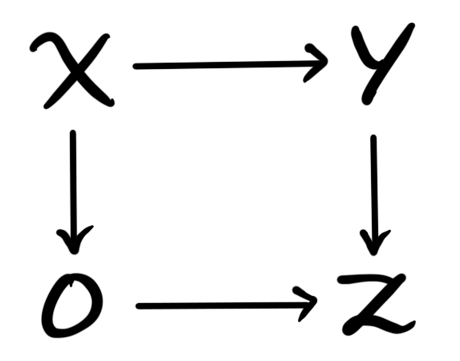
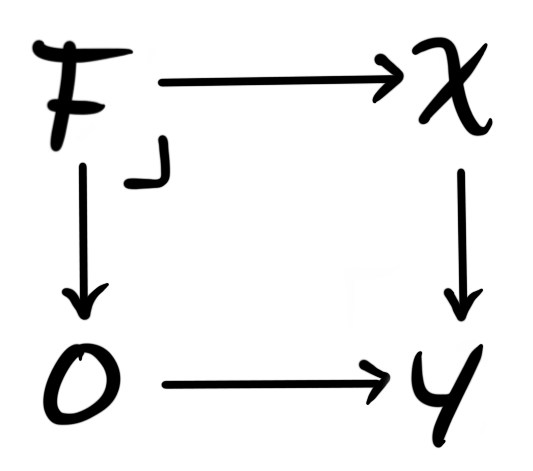
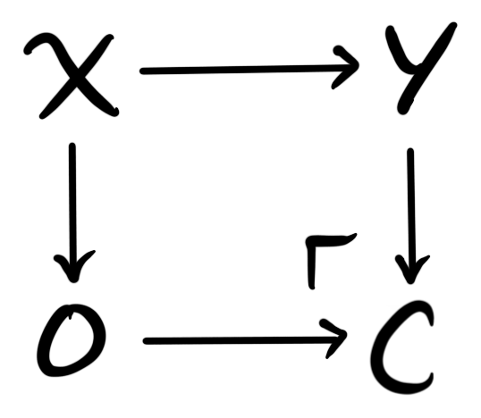
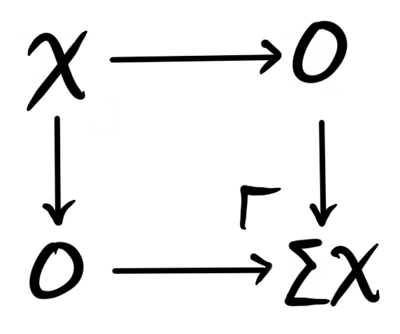
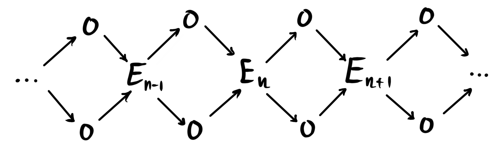
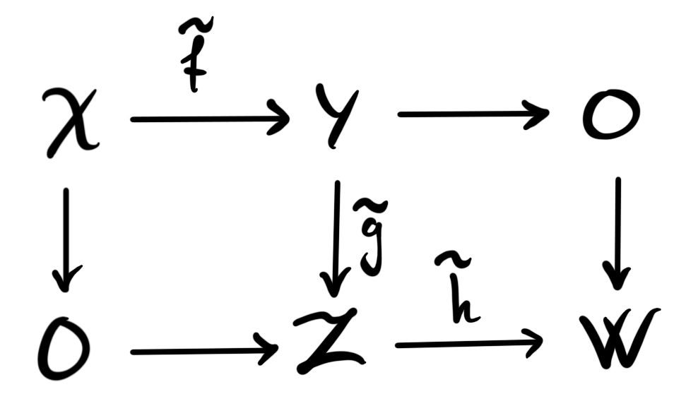

This semester I am taking part in a [seminar](https://folk.ntnu.no/runegha/seminar.html) on $\infty$-categories, administered by Rune Haugseng. So far we have covered roughly: the basic definitions, fibrations, limits, colimits, Joyal’s lifting theorem, equivalences, straightening, Yoneda lemma, adjunctions and Kan extensions. This week it is my turn to give a talk on stable $\infty$-categories, and this blog post will hopefully be some sort of lecture notes for this talk. The intersection of things in this post and the contents of the talk should at least be non-empty. 

The plan for this post, and the talk, is to cover the basics as well as the two motivating examples: the $\infty$-category of spectra, and the derived $\infty$-category of an abelian category. Most of this theory can be found in the first chapter of “Higher algebra” (denoted henceforth by HA) by Jacob Lurie.

## Basics

The first thing that should be said is that by $\infty$-category we mean quasi-category. These are simplicial complexes that satisfy the lifting property for every inner horn. We have covered the definition and some intuition in [an older blog post](), so the reader unfamiliar with the definition and what it means should look there first (or into any of the other hundreds of much better sources on quasi-categories). We will assume basic knowledge on $\infty$-categories in this post, and will try to refer to other posts with relevant material whenever applicable. 

 **Definition:**  Let $\mathcal{C}$ be an $\infty$-category. A zero object in $\mathcal{C}$ is an object $0$ which is both initial and terminal. If such an object exists, then we say that $\mathcal{C}$ is a pointed $\infty$-category. 

 **Definition:**  A triangle in $\mathcal{C}$ is a diagram 

where $0$ denotes a zero object in $\mathcal{C}$. We say a triangle is a fiber sequence if the diagram is a pullback square, and a cofiber sequence if the diagram is a pushout square. If we have a map $f:X\longrightarrow Y$, then a fiber of $f$ is a fiber sequence 

and a cofiber of $f$ is a cofiber sequence 

We often denote just the object as the fiber and cofiber, i.e. $fib(f)=F$ and $cofib(f)=C$, and leave the maps hidden in the notation. 

Note that fiber sequences are sometimes called exact triangles, while cofiber sequences are sometimes called coexact triangles. We stick to the naming convention of HA, where this material is developed in detail. 

We are now ready to define a stable $\infty$-category. The definition should hopefully feel somewhat familiar to any reader that have heard about stable model categories or abelian categories. Readers of this blog have encountered stable model categories in the post [the stable homotopy category](), so it is possible to go there for some intuition. Stable $\infty$-categories should be thought of as an $\infty$-categorical refinement of stable model categories, in the sense that presentations of stable $\infty$-categories are stable model categories. 

 **Definition:**  A stable $\infty$-category is a pointed $\infty$-category $\mathcal{C}$, such that all morphisms have both fibers and cofibers, and a triangle is a fiber sequence if and only if it is a cofiber sequence. 

The similarity to stable model categories is maybe not immediately apparent, as they are defined using an autoequivalence $\Sigma: \mathcal{C}\longrightarrow \mathcal{C}$, which is not visible in the above definition. We will however soon see that it is there. The similarity with abelian categories is maybe more apparent. An abelian category is a category with zero object (and some other stuff to get an additive category) such that every morphism has a kernel and a cokernel, and such that the image is isomorphic to the coimage, which means that the kernel of a cokernel is isomorphic to the cokernel of the kernel. This last requirement is similar to the requirement that fiber sequences and cofiber sequences coincide. The requirement to be an additive category is equivalent to saying that the category is enriched over abelian groups. It turns out that any stable $\infty$-category is enriched in spectra, helping solidify the idea that spectra should be thought of as a homotopical extension of abelian groups. We will talk more about these similarities in a later post I hope. 

From the definition there are two immediate things one can do. We know that we have a zero object $0$, which means that for any other object $X$, we have unique (up to contractible choice) maps $0\longrightarrow X$ and $X\longrightarrow 0$. We also know that any map has both a fiber and a cofiber, so a natural thing to look at are the fibers and cofibers of these two unique maps into and out from the zero object. These two definitions should hopefully feel familiar from algebraic topology. 

 **Definition:**  A cofiber of the map $0\longrightarrow X$ is a pushout of the diagram 

This pushout is called the suspension object of $X$, and is denoted $\Sigma X$. 

 **Definition:**  A fiber of the map $X\longrightarrow 0$ is a pullback of the diagram 

This pullback is called the loop object of $X$, and is denoted $\Omega X$. 

Since the category we form these is stable, we know that fiber sequences and cofiber sequences coincide, which gives us that $\Sigma$ and $\Omega$ are mutually inverse equivalences on $\mathcal{C}$. 

The first idea of a stable $\infty$-category comes from exactly these two above constructions. The idea is to iteratively use the above two constructions to create so-called spectrum objects in any $\infty$-category. 

## Spectrum objects

We have several times looked at the category of spectra, $Sp$, and its associated homotopy category — the stable homotopy category, $SHC$. The idea behind spectrum objects in a $\infty$-category is to emulate the construction of spactra from topological spaces. For some background on these objects see [this post](), and [this post]() for some insight into the stable homotopy category. The emulation will be made in such a way that the spectrum objects in the $\infty$-category of spaces are precisely the spectra we are already familiar with. The reader unfamiliar with spectra in the classical sense should at least look up the definition of a sequential spectrum, also called a pre-spectrum, in order to feel the familiarity with the following definition. 

 **Definition:**  Let $\mathcal{C}$ be a pointed $\infty$-category with all finite limits and colimits. A pre-spectrum object in $\mathcal{C}$ is a functor
$$E:\Z\times\Z\longrightarrow \mathcal{C},$$
such that $E(i,j)=0$ for $i\neq j$. 

In particular this means that only the diagonal elements $E(n,n)$ are non-trivial, so we denote these by $E_n$. We can then visualize a pre-spectrum object as

This should look familiar to any reader that has seen the classical definition of a sequential spectrum. We see that in this diagram we have a setup that looks a lot like the diagrams for suspension and loops, just strung together in an infinitely long sequence. Due to the definition of $\Sigma$  and $\Omega$ as the pushout and pullback respectively, we get by universal property, for any pre-spectrum object $E$ in $\mathcal{C}$, maps 
$$\alpha_n:\Sigma E_n\longrightarrow E_{n+1} \text{ and } \beta_n:E_n\longrightarrow \Omega E_{n+1}.$$

We can now look at som nicer types of pre-spectrum objects, where we make some restrictions on the above maps. 

 **Definition:**  Let $E$ be a pre-spectrum object in $\mathcal{C}$. We say $E$ is a spectrum object if the maps 
$$\beta_n:E_n\longrightarrow \Omega E_{n+1}$$
is an equivalence for all $n$. Note that these are also sometimes called the $\Omega$-spectrum objects, as to remind us that these are the analogues of $\Omega$-spectra from topology. We say $E$ is a suspension spectrum object if the maps
$$\alpha_n:\Sigma E_n\longrightarrow E_{n+1}$$
is an equivalence for all $n$. The full subcategory spanned by the spectrum objects in $\mathcal{C}$ is denoted by $Sp(\mathcal{C})$. 

 **Definition:**  Let $\mathcal{C}$ be an $\infty$-category with finite limits, in particular it has a terminal object, $\ast$. We define the stabilization of $\mathcal{C}$ to be the $\infty$-category 
$$Stab(\mathcal{C})=Sp(\mathcal{C}_ \ast),$$ 
where $\mathcal{C}_\ast$ is the category of pointed objects, i.e. the [under category]() of a the terminal object, $\ast$. 

We wont prove here that the stabilization of a $\infty$-category is in fact a stable $\infty$-category, but this is in fact the case. Equivalently, the stabilzation can be thought of as the category of reduced excisive functors $E:\mathcal{S}^{fin}_{\ast/}\longrightarrow \mathcal{C}$ from the $\infty$-category of finite type pointed spaces (this is the $\infty$-categorical analogue of pointed CW-complexes) into $\mathcal{C}$. These are the functors that send pushout squares to pullback squares, and sends the point object $\Delta^0$ to the terminal object $\ast$. This definition can be thought of as more in line with the Brown representability focused way of constructing spectra, as reduced excisive functors can be thought of as the homology theories on spaces with values in $\mathcal{C}$. 

As mentioned in the beginning of the section, we have $Sp = Stab(\mathcal{S})$, or in words: the stabilization of the $\infty$-category of spaces is the category of spectra. This means that we now have a description of $Sp$ as an $\infty$-category, and not just as a stable model category — which is the best we have [accomplished so far]() on this blog. The $\infty$-category of spectra is in a precise sense the universal example of stable $\infty$-category. It is in fact the free stable $\infty$-category on one generator, the sphere spectrum. 

## Derived $\infty$-category

In normal homological algebra we are familiar with the concept of derived categories of abelian categories, these being a localization of the category of chain complexes at the quasi-equivalences. The category of chain complexes has a concept of homotopy, often called chain-homotopy, which hints at the idea that there is some $\infty$-categorical things going on. The theory of derived $\infty$-categories seeks to be an “enhancement” of the normal derived category into the world of $\infty$-categories, in the sense that the homotopy category of the derived $\infty$-category should be the normal derived category. 

The construction of the derived $\infty$-category uses the concept of enriched categories, which we have covered a bit of in [an earlier post](), so the reader unfamiliar with this theory should look there for a half-ok overview. 

The objects we want to have in the derived $\infty$-category are — as in the case of the normal derived category — the chain complexes of objects in the abelian category. To be even more specific, for an abelian category $\mathcal{A}$, we want the objects of $D_\infty(\mathcal{A})$ to be the unbounded chain complexes in $\mathcal{A}$. Since we want the homotopy category to be the usual derived category, we should want that the equivalence classes of morphisms are the usual derived hom, $RHom$. 

 **Definition:**  Let $\mathcal{A}$ be an abelian category. We write $Ch(\mathcal{A})$ for the category of unbounded chain complexes in $\mathcal{A}$. Any such category is enriched in chain complexes of abelian groups, $Ch(\Z)=Ch(Ab)$. 

In order to create an $\infty$-category we will use the simplicial nerve construction, but, in order to use this we need to produce a category that is enriched over simplicial sets. From the above definition we now have a category enriched over chan complexes of abelian groups, so the question turns into finding a translation between chain complexes of abelian groups and simplicial sets. Luckily for us, there is one such translation, namely the Dold-Kan correspondence. 

 **Theorem (Dold-Kan correspondence):**  Let $\mathcal{A}$ be an abelian category. There is an equivalence of categories 
$$\Gamma:Ch^+(\Z)\leftrightarrows Ab_\Delta:N$$
between the category of connective chain complexes of abelian groups, and the category of simplicial abelian groups. The functors $N$ and $\Gamma$ are certain nerve and realization functors, which we wont go into detail about. 

The two important things here is that we can turn a chain complex into a simplicial abelian group, and that the equivalence is a Quillen equivalence if we equip these categories with their standard [model structures](). Being a Quillen equivalence means that these model structures are preserved, in particular that the chain homotopies correspond to simplicial homotopies, and homology of a chain complex corresponds to the homotopy of the corresponding simplicial abelian group. 

From a simplicial abelian group we can easily get a simplicial set, by just forgetting the group structure. This is just the forgetful functor
$$For: Ab_\Delta\longrightarrow Set_\Delta.$$

The remaining piece of the puzzle is getting from unbounded chain complexes to connective chain complexes. We want to do this in a homology preserving way, hence we send an unbounded chain complex 
$$\cdots\longrightarrow A_{2}\longrightarrow A_1\longrightarrow A_0\overset{f_0}\longrightarrow A_1\longrightarrow A_2\longrightarrow \cdots$$
to the connective chain complex
$$\cdots\longrightarrow 0\longrightarrow 0\longrightarrow ker(f_0)\longrightarrow A_1\longrightarrow A_2\longrightarrow \cdots.$$

We can then finally form the functor 
$$K:Ch(\Z)\longrightarrow Ch^+(\Z)\overset{\Gamma}\longrightarrow Ab_\Delta\longrightarrow Set_\Delta. $$

By using this functor we can turn any dg-category — that is, categories enriched in $Ch(\Z)$ — into a simplicially enriched category. Since we want to use the simplicial nerve construction, we need one more piece of information in order to be certain that we actually get a $\infty$-category. The fact we need is that the simplicial set $K(A_\bullet)$, for some chain complex $A_\bullet$, is a Kan complex, and not just an arbitrary simplicial set. We do in fact get that this holds, due to the underlying simplicial set of any simplicial group being a Kan complex. The Kan complexes that are simplicial groups even have nice algorithms to determine the lifts of inner and outer horns, so these are particularily nice Kan complexes. For an intuitive explanation of why the underlying simplicial set of a simplicial group is a Kan complex, we can consider the fact that a group can be viewed as a one-object groupoid. A simplicial group can in this light be thought of as a simplicial groupoid, which along with Kan complexes are models for $\infty$-groupoids. The fact that a simplicial group has an underlying Kan complex can then be thought of a a sort of change of model. This is not in any way precise, but serves (for me at least) as some motivation and insight into why the abovementioned fact is true. 

Anyway, we can now form the $\infty$-categorical analogue of $Ch(\mathcal{A})$, which we will denote by $K_\infty(\mathcal{A})$. To do this we first define the so-called dg-nerve of a dg-category. 

 **Definition:**  Let $\mathcal{C}$ be a dg-category, i.e. a category enriched in $Ch(\Z)$. We define its dg-nerve to be 
$$N^{dg}(\mathcal{C})=N^\Delta(\mathcal{C}_ \Delta)$$
where $\mathcal{C}_\Delta$ is the Kan enriched category obtained from $\mathcal{C}$ via the functor $K$ constructed above. 

The name of this nerve-construction is sometimes used for another way to construct another equivalent category, mainly in HA, so beware that this notation and naming convention is not perfect. Since $K(A)$ is a Kan-complex, we have that $N^{dg}(\mathcal{C})$ is an $\infty$-category. 

 **Definition:**  Let $\mathcal{A}$ be an abelian category. We define an $\infty$-category $K_\infty(\mathcal{A})$ by 
$$K_\infty(\mathcal{A})=N^{dg}(Ch(\mathcal{A})).$$

This category should be thought of as the $\infty$-category of chain complexes in $\mathcal{A}$. The homotopy category of $K_\infty(\mathcal{A})$ is the homotopy category of chain complexes we are used to from homological algebra, often denoted $K(\mathcal{A})$ — hence the suggestive notation of $K_\infty$. We want to continue to emulate the standard homological algebra case, in which we localize the category of chain complexes at the quasi-isomorphisms. This is because we mostly care about information in homology, but the existence of non-invertible quasi-isomorphisms means that we have to be a bit careful. By inverting these non-invertible maps we can be less careful, and get in the end a nicer category. In the classical scenario, the derived category — being the chain complexes localized at the quasi-isomorphisms — is a triangulated category, which is a nice structure to have around. So, we need to know what the $\infty$-categorical analogue of localization is. 

### Dwyer-Kan localization

The idea of the below construction is to emulate the universal property of localizations in the situation of $1$-categories. The below construction and definitions are mostly taken from the nice [lecture series] by Achim Krause and Thomas Nicolaus on Cyclic homology. 

 **Definition:**  Let $\mathcal{C}$ be an $\infty$-category and $W\subseteq \mathcal{C}_1$ be any subset of morphisms. A functor $F:\mathcal{C}\longrightarrow \mathcal{D}$ is called a Dwyer-Kan localization at $W$ if 

- $F$ takes morphisms in $W$ to equivalences in $\mathcal{D}$
- For every $\infty$-category $\mathcal{E}$, the map $Fun(\mathcal{D}, \mathcal{E})\longrightarrow Fun(\mathcal{C}, \mathcal{E})$ is fully faithful, and has essential image equivalent to the full subcategory $Fun^W(\mathcal{C}, \mathcal{E})\subseteq Fun(\mathcal{C}, \mathcal{E})$ of those functors that send $W$ to equivalences.

This last requirement is a sort of universal property for the functor $F$, in that functors out of $\mathcal{D}$ correspond to functors out of $\mathcal{C}$ that send $W$ to equivalences. This means that $\mathcal{D}$ is a sort of universal category where maps in $W$ are invertible. We denote a Dwyer-Kan localization of $\mathcal{C}$ at $W$ by $\mathcal{C}[W^{-1}]$. 

The most simple example we can make is on the category $\mathcal{C}=\Delta^1$. This category has three maps: the identities $0\longrightarrow 1$, $1\longrightarrow 1$ and the map $0\longrightarrow 1$, being the only map that is not an equivalence. We choose $W$ to be the singleton set containing this last map. 

We need to check that $Fun(\Delta^0, \mathcal{E})\longrightarrow Fun^W(\Delta^1, \mathcal{E})$ is an equivalence of categories for all $\infty$-categories $\mathcal{E}$. We can do this by proving that it is both fully faithful and essentially surjective. In order to show the latter we need to find a preimage to any diagram $E\overset{w}\longrightarrow E'$, where $w$ is an equivalence in the image of $W$. This can be given by $E\overset{id_E}\longrightarrow E$. In the category $Fun(\Delta^1, \mathcal{E})$ we have that $Map(A\to A', B\to B')$ is equivalent to the pullback of 

But, in the subcategory $Fun^W(\Delta^1, \mathcal{E})$ the maps $f$ and $g$ will be equivalences, which makes also the maps $g\circ -$ and $-\circ f$ into equivalences. This means that the pullback will just be $Map(A, B)$, which means that $Fun(\Delta^0, \mathcal{E})\longrightarrow Fun^W(\Delta^1, \mathcal{E})$ is fully faithful. 

We can use this example to construct Dwyer-Kan localizations for all $\infty$-categories. We simply take the pushout 

in the category of $\infty$-categories, $Cat_\infty$. We do not, however, prove that this in fact produces a localization of the category $\mathcal{C}$. 

Now that we know that Dwyer-Kan localizations exist, we can finally state the definition of the derived $\infty$-category of an abelian category $\mathcal{A}$. Recall first that the set of quasi-isomorphisms are the maps that induce isomorphisms in homology. In our case, we have transferred the enrichment over chain complexes into an enrichment over Kan complexes, in a way that turns homology into homotopy. Hence we can define quasi-isomorphisms in the category $K_\infty(\mathcal{A})$ as the $\pi_\ast$-isomorphisms, i.e. the weak homotopy equivalences. 

 **Definition:**  Let $\mathcal{A}$ be an abelian category and $W$ be the set of quasi-isomorphisms in $K_\infty(\mathcal{A})$. We define the derived $\infty$-category of $\mathcal{A}$ to be the Dwyer-Kan localization of the $\infty$-category of chain complexes in $\mathcal{A}$ at the quasi-isomorphisms, i.e. $D_\infty(\mathcal{A})=K_\infty(\mathcal{A})[W^{-1}]$. 

We will also not prove that the derived $\infty$-category $D_\infty(\mathcal{A})$ for an abelian category $\mathcal{A}$ is actually stable, but this is in face the case. We mentioned a bit earlier that the nice thing about the classical derived category is that it is triangulated. We have constructed $D_\infty(\mathcal{A})$ in such a way that we have $hD_\infty(\mathcal{A})\simeq D(\mathcal{A})$; the homotopy category of the derived $\infty$-category is the classical derived category. This means in particular that the homotopy category of the derived $\infty$-category is triangulated. We round off this post by asking and answering a natural followup question to this information. Is the fact that $hD_\infty(\mathcal{A})$ is triangulated a special case, or is this a consequence of a more general fact about stable $\infty$-categories? In more precise words: is the homotopy category of a stable $\infty$-category always triangulated? This turns out to be true. In order to have a triangulated structure, we need to know what the distinguished triangles are, so lets quickly define these. 

 **Definition:**  A diagram $X\overset{f}\longrightarrow Y\overset{g}\longrightarrow Z\overset{h}\longrightarrow \Sigma X$ in $h\mathcal{C}$ is a called a distinguished triangle, if there is a diagram
  
in $\mathcal{C}$, such that both squares are pushout squares, $\tilde{f}$ and $\tilde{g}$ represent $f$ and $g$ respectively, and such that the map $h$ is the composition of the homotopy class of $\tilde{h}$ with the equivalence $W\simeq \Sigma X$. 

 **Theorem:**  Let $\mathcal{C}$ be a stable $\infty$-category. Then the class of distinguished triangles, together with the induced suspension object functor $\Sigma$ make $h\mathcal{C}$ into a triangulated category. 

This means in particular that stable $\infty$-categories are enhancements of triangulated categories. We will not go through the proof, but we suggest looking at the proof in HA. In particular, we suggest looking at the proof for the octrahedral axiom, which is really neat and simple in this framework. 

## Remark on exotic algebraic models

As a final end to this post we contemplate the following thoughts. We have now found two examples of stable $\infty$-categories, one that emulates algebraic topology, and one that emulates homological algebra. We can ask, are there similarities between these two constructions? Are there stable $\infty$-categories that have the structure of both of these examples? More precisely, are there ever equivalences between categories of spectra and derived $\infty$ -categories, or $\infty$-categories of chain complexes? This turns out to almost never be the case, mainly because the higher homotopy information contained in spectra are too complicated to be realised using algebraic gadgets. One of the only equivalences of $\infty$-categories of this form is the equivalence
$$Sp_\mathbb{Q} \simeq K_\infty(\mathbb{Q})$$
between rational spectra and chain complexes of rational vector spaces. But, we can ask a more nuanced question. Even though there are few of these equivalences of $\infty$-categories, there might be equivalences between them if we remove, or truncate, the higher homotopy information. We might therefore look for equivalences 
$$h_k \mathcal{C} \simeq h_k D(\mathcal{A})$$
for some subcategory $\mathcal{C}\subseteq Sp$ and some abelian category $\mathcal{A}$. Here $h_k$ denotes the homotopy $k$-category, and such equivalences are called exotic algebraic models. This is in fact exactly what my phd-project centres around, finding exotic algebraic models of special categories of spectra in a subfield of stable homotopy theory called chromatic homotopy theory. We will then naturally meet this topic a lot in the future, as I hopefully continue to write about what I am learning.