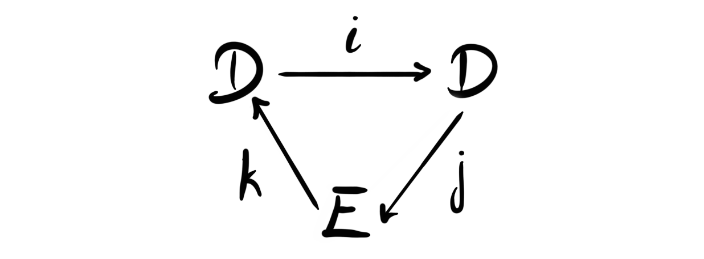
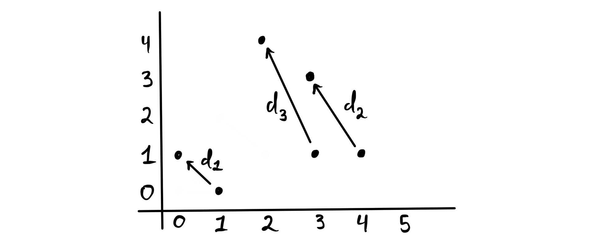
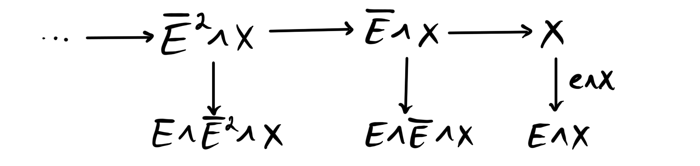
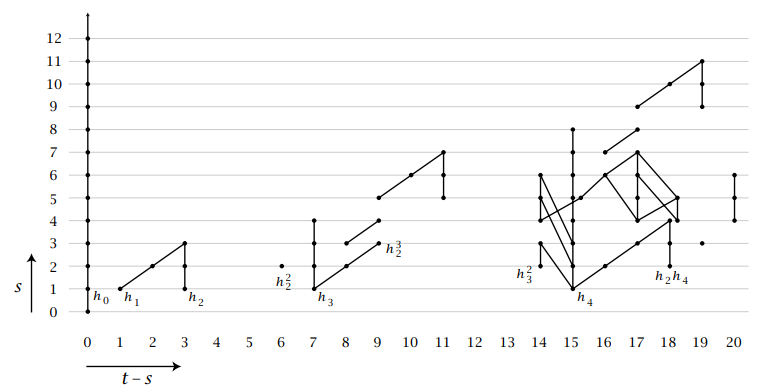

Recently my friend Elias started his own [math blog](https://eka2499.github.io/) adventure, and his [first post](https://eka2499.github.io/p/spectral-sequences-and-multicomplexes-part-i/) gave a nice introduction to spectral sequences. Reading it I remembered that I should really understand some of the parts better myself, because a lot of the arguments one makes in chromatic homotopy theory are based on spectral sequences. There is a framework for constructing spectral sequences that are not covered in my [old post]() on them, as well as Elias’ post, and that is creating spectral sequences from exact couples. So, since I will use these techniques later in my research, and probably later on this blog, I thought it worthwhile to discuss. In particular we look into producing spectral sequences from filtered spectra, as this is the part that is most relevant for my research. 

## Exact couples

Spectral sequences are very iterative objects. One starts on a place of coarse and not very comprehensive information and iterates a procedure in order to refine this information. If we are careful in our construction, and use it in nice situations, this iterative information converges to the thing we are interested in. The information we are interested in is usually some form of homology, cohomology or derived functor, and the iteration process is usually made by creating some differentials and producing some form of homology or cohomology. For some general information about this you can see my old blog post or Elias’ post. 

Ok, let’s start off by defining what an exact couple actually is.

 **Definition:**  An *exact couple* $(D, E; i,j,k)$ is a pair of modules $D$ and $E$, together with homomorphisms $i, j, k$ such that the diagram 

is exact at each vertex. 

The notion of being exact at each vertex here means that we have $Im(i)=Ker(j)$, $Im(j)=Ker(k)$ and $Im(k)=ker(i)$. So it is the standard exactness we use in homological algebra. Notice also that the composition $d:=j\circ k:E\longrightarrow E$ is a differential on $E$, as we have 

$$
d\circ d = (j\circ k)\circ (j\circ k) = j\circ (k\circ j)\circ k = j\circ 0\circ k=0.
$$

The composition $k\circ j$ is zero as we have $Ker(k)=Im(j)$. So having an exact couple gives us a differential on the module $E$, and this is exactly how we start the iterative process. 

So, how does the iteration work? When we have a differential one of the first things we should think about doing is taking homology. This is precisely the thing we do to form the so-called derived couple of an exact couple.

 **Definition:**  Let $(D, E;i,j,k)$ be an exact couple. We define its *derived couple* as the tuple $(D', E';i', j', k')$ defined by 

- $D'=iD$
- $E'=H(E, d)$
- $i'=i_{|D'}$
- $j'$ takes $i(x)$ into the $d$-homology class $[j(x)]$ for $x\in D$
- $k'$ takes $[y]$ for some $y\in E$ to $k(y)$.

And in diagram form: 

We see that we make several choices in this definition, as we choose representatives from different homology classes. But one can show that these choices does not matter, and we get well defined maps. 

 **Lemma:**  The derived couple of an exact couple is again an exact couple. 

*Proof:* We need to check that the diagram is exact at each vertex. We show only for $Im(k')=Ker(i')$, the other vertices are similar types of diagram chase arguments.

Let $x\in Ker(i)$. In particular we know $x\in D'$, which means $x=i(y)$ for some $y\in D$. We then have $0=i'(i(y))$ since its in the kernel. But $i'$ is just the restriction of $i$ to its image, hence we have $0=i(i(y))$, which means $i(y)$ is in the kernel of $i$, and by exactness that $i(y)$ is in the image of $k$. Hence we can find $a\in E$ such that $i(y)=k(a)$. Choosing the class $[a]\in E'$ gives us $k'[a] = k(a)=i(y)=x$, hence we have that $x$ is in the image of $k'$. 

Choose now $x\in Im(k')$. This means we have a homology class $[a]$ such that $k'[a]=x$. By definition this means that $x=k(a)$. We then have $i'(x)=i'(k(a))=i(k(a))=0$ by exactness. 

The cool thing about this result is that we can start iterating this procedure, and form an infinite tower $(D^n, E^n;i^n, j^n, k^n)$ of exact couples. In each of these towers $E^n$ is a differential group with $d^n=j^n\circ k^n$ and $E^{n+1}=H(E^n, d^n)$.

 **Definition:**  The sequence $E^n$ is called the *spectral sequence* of the exact couple $(D, E;i,j,k)$.

For the people familiar with spectral sequences this should look familiar, but perhaps feel a bit weird. It seems like we have only one grading, where in the usual scenario we have three. This can easily be implemented by considering $D$ and $E$ to be bigraded modules instead. We will do so below. Even though most examples use three gradings, there are also examples in the more simple situation described above, like the Bockstein spectral sequence. 

## Exact couples in spectra

One important use case of the theory we developed above is to study spectra, i.e. stable phenomena in topology. One of the crucial ways to do this is by understanding their homotopy groups, which we know from earlier discussions generalize the notion of stable homotopy groups of topological spaces via the suspension spectrum construction. We want to create spectral sequences that allows us to compute these homotopy groups, in particular the coefficients $\pi_* X$ of some spectrum $X$. One way to do this is to use filtered spectra.

 **Definition:**  A *filtration* on a spectrum $X$ is a $\Z$-graded sequence of spectra $X_\bullet$, such that $X$ is the homotopy colimit $X\simeq \underrightarrow{\lim}_kX_k$. A *filtered spectrum* is then a spectrum together with a chosen filtration. 

Often we work with a simpler definition, namely that a filtration is simply a sequence

$$
\cdots \rightarrow X_n\overset{f_n}\rightarrow X_{n-1}\rightarrow \cdots \rightarrow X_1\overset{f_0}\rightarrow X_0=X.
$$

This is a special case of the above definition, which is usually enough in the case of spectra. We will from this point onwards be using this simpler definition of a filtration, however, we note that the general definition is particularly nice, as it works just as well in any (nice) stable $\infty$-category. 

Since [the category of spectra has a model structure](), we can for all filtrations produce one where the $f_n$’s are all fibrations (or cofibrations) by taking fibrant (cofibrant) replacements everywhere. In consequence filtrations of a spectrum $X$ is in the literature sometimes called a *tower of fibrations* over $X$. 

Given a filtered spectrum $X$ we write $A_k$ for the homotopy cofiber of its $k$’th stage, i.e. $A_k = cofib(f_k)$. We then obtain the diagram 

where each stage $X_{n+1}\longrightarrow X_n\longrightarrow A_n$ is a homotopy fiber sequence by construction. Recall that the goal is to understand $\pi_\ast X$. If we now apply $\pi_\ast$ to the diagram we get a new diagram

The functor $\pi_\ast$ sends fiber sequences to long exact sequences, i.e. the [long exact sequence in homotopy groups]() we are familiar with from algebraic topology. In our situation we get for each of the fiber sequences $X_{k+1}\longrightarrow X_k\longrightarrow A_k$ the long exact sequence

$$
\cdots \rightarrow \pi_{*+1}A_k\overset{\delta^k_{*+1}}\rightarrow \pi_*X_{k+1}\rightarrow \pi_*X_k\rightarrow \pi_*A_k\rightarrow \cdots
$$

We can interpret the connecting homomorphisms $\delta_*^k$ as maps of degree $-1$. This means we that we can incorporate it into the above diagram to get 

where now each triangle is a sort of rolled up version of the long exact sequence. Note that these triangles are **NOT** commuting. 

We can even further compress this diagram, and roll it up again, but instead considering the bigraded abelian groups $\pi_* X_\bullet$ and $\pi_* A_\bullet$. This gives us the diagram 

which should remind us of the diagrams in the beginning, namely an exact couple! We do not show here that the diagram is exact at each vertex. As we have now compressed two gradings into a single diagram we have bigraded maps, and the maps have the following bidegrees: 

- $i^1=\pi_* f_\bullet :  (-1,-1)$
- $j^1=\pi_* cofib(f_*) : (0,0)$
- $k^1=\delta: (1, 0)$ or $(-1,0)$ depending on homological or cohomological grading

When we pass to the corresponding derived couple the bidegrees of $i$ and $k$ are preserved, i.e. we have $|i^2|=(-1, -1)$ and $|k^2|=(1, 0)$. The bidegree of $j$ does change however. As we can think about $j^1$ as first choosing a preimage of $i$ and then applying $j$ we get $|j^2|=|j|-|i| = (1,1)$. In particular this means that the bidegree of $j^r$ increases by $(1,1)$ each time we pass to the next derived couple, i.e. $|j^r|=(r-1,r-1)$. The first differential $d^1$  is given by the composition $j\circ k$, hence has bidegree $|d^1|=|j|+|k|=(1,0)$. Since we have $d^r=j^r\circ k^r$ the bidegree of the $r$’th differential is given by $|d^r|=|j^r|+|k^r| = (r,r-1)$, which is what we are familiar with from normal spectral sequences, i.e. 

$$
d^r:E^{s,t}_r\longrightarrow E^{s+r, t+r-1}_r .
$$

It is at this stage often convenient and customary to shift the grading from $(s,t)$ into $(t-s, s)$ before drawing the normal spectral sequence diagrams. This convention is often called the Adams type grading convention, and it makes it such that $t$ counts the number of times we have wounded around the triangle in the derived couple. Drawing the differentials in the $r$’th page in the spectral sequence then always goes one to the left and $r$ upwards:

## The Adams spectral sequence

To quickly summarize all we have discussed until now: for each filtered spectrum $X_{\bullet}$ we get a spectral sequence $E_r$ with first page given by $$E^{s,t}_1 = \pi_{t-s}cofib(X_{s}\overset{f_s}\longrightarrow X_{s-1}).$$

What can we use this for? Maybe the most used applications is the socalled Adams spectral sequence, and its generalization, the $E$-Adams spectral sequence. Let’s construct the most general spectral sequence, and then try to see how it is specialized afterwards. 

For the construction we must choose a commutative ring spectrum $E$ such that the module $E_\ast E$ is flat over over $\pi_\ast E$. Since the sphere spectrum is the monoidal unit in $Sp$, we have a unit map $\mathbb{S}\overset{e}\longrightarrow E$. Denote the cofiber of $e$ by $\overline{E}$, hence we have a cofiber sequence (or equivalently a fiber sequence as $Sp$ is stable) $$\overline E \longrightarrow \mathbb{S}\longrightarrow E.$$ If we now take some spectrum $X$ that we are interested in, we can smash $X$ with the unit map to get a map $X\longrightarrow E\wedge X$, where we have used the fact that $\mathbb{S}$ is the unit, hence $\mathbb{S}\wedge X \simeq X$. The fiber of this map is $\overline E\wedge X$ due to the fiber sequence from the unit map. We now have a map $\overline E\wedge \overline E \wedge X\longrightarrow \overline E\wedge X$, that has cofiber $E\wedge \overline E\wedge X$ . In general we have a map $\overline E^n\wedge X \longrightarrow \overline E^{n-1} \wedge X$, that has cofiber $E\wedge \overline E^{n-1} \wedge X$. we assemble all these maps we get a sequence 

This sequence is a filtration on $X$, and is called the $E$-Adams filtration or the $E$-Adams tower. We can think about this tower as iteratively projecting out all of the $E$-homology of $X$. 

If we write $X_n = \overline E^n \wedge X$ and $A_n = E\wedge X_n$ we get the standard for of a the filtration

From the previous discussion we know that from a filtered spectrum we can produce a spectral sequence. This we now know has first page $E^{s,t}_ 1 = \pi_{t-s}(A_s)$. This spectral sequence is called the $E$-Adams spectral sequence. 

We also know that homotopy groups are just maps from the sphere spectrum (by definition), so we have $E^{s,t}_ 1 = [ \mathbb{S}, A_s]_{t-s}$. This is the point where it becomes important that we assumed that $E$ had a flatness condition, i.e. that $E_\ast E$ is flat over $\pi_\ast E$. For any spectrum $Y$ we have an isomorphism

$$
\pi_\ast (E\wedge Y)\cong Hom^\ast_{\pi_\ast E}(\pi_\ast E, E_\ast Y),
$$

but when $E$ has this flatness condition, the group homomorphisms on the right lift to morphisms in an even nicer category, namely the category of comodules over $E_\ast E$. The group $E_\ast E$ is actually a Hopf algebra, and is often called the dual $E$-Steenrod algebra. Even more is true, the pair $(E_\ast E, \pi_\ast E)$ is a commutative flat Hopf algebroid. What this is and what it means we will save for a later post. This means we have a description of the $E$-Adams spectral sequence we produced above for a spectrum $X$ as 

$$
E_1^{s,t} \cong Hom_{Comod_{E_\ast E}}^{t-s}(\pi_\ast E, E_\ast(A_s)).
$$

The category of comodules over a flat Hopf algebroid turns out to be a pretty nice abelian category. In particular, as the second page is computed as the homology of the previous, we get that the second page consists of $Ext$ groups in $Comod_{E_\ast E}$, i.e. 

$$
E_2^{s,t} \cong Ext_{Comod_{E_\ast E}}^{s,t}(\pi_\ast E, E_\ast (A_s)).
$$

This is of course a complicated object, but $Ext$ groups are possible to calculate. 

So what does this $E$-Adams spectral sequence converge to? It turns out to be highly related to localization and completion of homotopy groups, or if we recall the theory of [Bousfield localization](), the localization of spectra. If we for example choose $E=H\mathbb{F_p}$, the Eilenberg-Maclane spectrum of the finite field with $p$ elements, then the spectral sequence converges to the $p$-complete homotopy groups, i.e. 

$$
E^{s,t}_ r \implies \pi_\ast X_p^\wedge
$$

In particular, if we choose $p=2$ and $X=\mathbb{S}$, then this is the classical Adams spectral sequence used to compute the $2$-primary component of the homotopy groups of spheres, i.e.

$$
Ext^{s,t}_ {\mathscr{A}^\ast}(\mathbb{F_2}, \mathbb{F}_2)\implies \pi_\ast \mathbb{S}_2^\wedge .
$$

Here $\mathscr{A}^\ast$ is the dual Steenrod algebra, which is isomorphic to $H\mathbb{F}_ {2\ast}H\mathbb{F}_2$, and $\pi_\ast H\mathbb{F}_2 = \mathbb{F}_2$. Much of the beginning of this spectral sequence has been calculated, but much reasearch is still going into it. Here is an image, [curtesy of Allen Hatcher](http://pi.math.cornell.edu/~hatcher/SSAT/SSch2.pdf), of parts of the $E_2$ page. 

Here each dot represents a copy of $\Z_2$, the differentials are the lines sloping to the left, while the lines going straight up represent multiplication by $2$, and the lines sloping to the right represent multiplication by $h_1$. Hence we also encounter in this picture the multiplicative structure in the spectral sequence, which we have not yet talked about. The elements $h_1$, $h_2$, and $h_3$ are the elements corresponding to the classical Hopf maps, i.e. the maps of spheres with Hopf invariant $1$. We studied $h_1$ quite a bit in the [first blog post about homotopy groups of spheres](). The fact that $h_4$ is killed by a differential can then be described as the reason there is no finite dimensional real division algebras other than $\mathbb{R}$, $\mathbb{C}$, $\mathbb{H}$ and $\mathbb{O}$, as the maps of spheres with Hopf invariant $1$ form the only dimensions where this is possible. I reccommend reading the explanation of the diagram featured in the link above to Hatcher, as I have been very brief here. 

We can also choose other spectra to create spectral sequences, like $E=MU$, the [complex cobordism spectrum](). This produces the so-called Adams-Novikov spectral sequence. This is a very complicated spectral sequence due to its strong potential. We haven’t gone into why these $E$-Adams spectral sequences have something to do with localization and completion, but it is related to a concept called nilpotent completion of spectra. So, the Adams-Novikov spectral sequence 

$$
E_2^{s,t} \cong Ext_{Comod_{MU_\ast MU}}^{s,t}(\pi_\ast MU, MU_\ast (A_s))
$$

converges to the homotopy groups of the $MU$-nilpotent completion of the spectrum $X$. But all spectra are already $MU$-nilpotent complete, hence this just gives the full homotopy groups of $X$. We could then use this to compute the stable homotopy groups of the spheres by letting $X=\mathbb{S}$, i.e. 

$$
E_2^{s,t} \cong Ext_{Comod_{MU_\ast MU}}^{s,t}(\pi_\ast MU, \pi_\ast MU)\implies \pi_\ast \mathbb{S}.
$$

As we already know that the homotopy groups of spheres are terribly complicated, we should expect this spectral sequence to also be terribly complicated. We can make it a bit simpler by using $BP$, the [Brown-Peterson spectrum](), instead of $MU$. This would allow us to compute the homotopy groups of $\mathbb{S}$ “one prime at the time”, which we could later use to compute the full homotopy groups. This spectral sequence is also usually called the Adams-Novikov spectral sequence, as its really exactly the same as the one above based on $MU$, just in the category of [$p$-local spectra]() instead of all spectra. Because the potential for computing the homotopy groups of spheres is there, we should however also expect it to be very difficult to compute. 

I will leave off this blog post by stating a recurring theme of these last few paragraphs — a theme we have also encountered before. It is a statement sometimes called Mahovald’s uncertainty principle, and very informally says: Any easy to compute spectral sequence converging to the homotopy groups of spheres that can be written down using homological algebra, will be infinitely wrong.