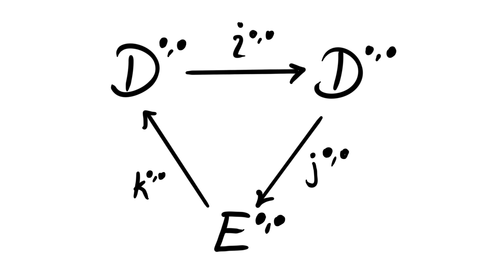

## Introduction

In the last post we studied homology theories as abstract functors from stable $\infty$-categories to abelian categories. We showed that for every stable $\infty$-category $\mathcal{C}$ there is a universal homology theory which all others factor through, namely the Yoneda embedding into the Freyd envelope,

$$
y\colon \mathcal{C}\longrightarrow A(\mathcal{C}).
$$

The fact that this is universal means that for any homology theory $H\colon \mathcal{C}\longrightarrow \mathcal{A}$ there is an essentially unique factorization 

$$
\mathcal{C}\overset{y}\longrightarrow A(\mathcal{C})\overset{L}\longrightarrow \mathcal{A}
$$

where $L$ is an exact functor of locally graded abelian categories. 

In this blog post we continue this story and try to understand it in a bit more detail. Our guiding example throughout will be the main example from last time — mod $p$ singular homology. Recall that this is a functor 

$$
H_*(–;\mathbb{F}_p)\colon Sp\longrightarrow Vect_{\mathbb{F}_p},
$$

where we associate to a spectrum $X$ the homology of the singular cochains on $X$, with coefficients in $\mathbb{F}_p$. We know that all homology theories on spectra are representable, and mod $p$ singular homology is represented by the mod $p$ Eilenberg-MacLane spectrum $H\mathbb{F}_p$. 

## Adapted homology theories

A natural thing to wonder is how the category $\mathcal{A}$ is related to $A(\mathcal{C})$, at least in nice situations. The category $A(\mathcal{C})$ is some category of presheaves, so we might wonder if $\mathcal{A}$ could be some category of sheaves and $L$ some sort of sheafification? In that case, which topology do we sheafify with respect to? 

A sheafification is in some sense the universal way to produce a sheaf from a presheaf. If we have some category with a topology, i.e. a site, then the category of sheaves on this site includes fully faithfully into the category of all presheaves. This inclusion has a left adjoint, which is what we call the sheafification with respect to the given topology. This means in particular that sheafification is a localization. 

In order for this to be the case for our functor $L$ we need that $\mathcal{A}$ is — at least up to equivalence — a subcategory of $A(\mathcal{C})$. This is the case when we have a fully faithful functor $\mathcal{A}\longrightarrow A(\mathcal{C})$. In order for $L$ to be some sort of sheafification we need that this fully faithful functor is an adjoint of $L$, in particular that this fully faithful “inclusion” is a right adjoint, which we then naturally denote by $R$. When this fully faithful functor $R$  is a right adjoint to $L$ we have that $L$ is a left adjoint to $R$ by definition. Hence $L$ is a sheafification, at least up to equivalence of categories. 

When this is the case, i.e. that our essentially unique exact functor $L$ has a fully faithful right adjoint, then we say that the homology theory $H = L\circ y$ is an adapted homology theory. 

Adapted homology theories are important in stable homotopy theory, as they correspond exactly to the homology theories that have associated Adams spectral sequences! Before we see why this is the case we describe a more “approachable approach” to adapted homology theories, by looking at certain criteria they must satisfy. 

By the factorization theorem we know that $L$ is exact. It is a general fact that the right adjoint to an exact functor preserves injectives, hence the adjoint $R(i)$ of an injective object $i\in \mathcal{A}$, is injective in $A(\mathcal{C})$. Since the representables are injective and generate $A(\mathcal{C})$ under finite limits, we have for an injective $j\in A(\mathcal{C})$ a map $j\longrightarrow y(c)$ for some object $c\in \mathcal{C}$. Thus $j$ is a direct summand of $y(c)$, and is represented by this summand if it exists. If we assume that $\mathcal{C}$ is idempotent complete (for example for any presentable stable $\infty$-category) then this summand always exists. Hence we have for an injective object $i\in \mathcal{A}$ an object $i_\mathcal{C}$ representing $R(i)$, i.e. $R(i)\simeq y(i_\mathcal{C})$. 

This means that we have produced a lift $i_\mathcal{C}$ for any injective object $i\in \mathcal{A}$. By a lift for an injective object $i\in \mathcal{A}$ we mean an object $i_\mathcal{C}\in \mathcal{C}$ such that $i_\mathcal{C}$ represents the functor $Hom_\mathcal{A}(H(–),i)\colon \mathcal{C}^{op}\longrightarrow Ab$, i.e. 

$$
Hom_\mathcal{A}(H(–),i)\simeq [–,i_\mathcal{C}].
$$

Since $R$ is fully faithful we have that the counit of the adjunction, $LR\longrightarrow id_\mathcal{A}$ is an isomorphism. Hence $LR(i)\simeq i$ for any injective $i$. But, we also have $R(i)\simeq y(i_\mathcal{C})$ for some $i_\mathcal{C}\in \mathcal{C}$, hence we get that

$$
i\simeq LR(i)\simeq Ly(i_\mathcal{C})\simeq H(i_\mathcal{C}).
$$

Note that in the case where $R$  is not fully faithful we still get a comparison map 

$$
H(i_\mathcal{C})\simeq Ly(i_\mathcal{C})\simeq LR(i)\longrightarrow i
$$

from the counit of the adjunction. Thus, the existence of $R$ still gives us lifts for injectives, but not necessarily that the lifts correspond to the chosen injective under the homology theory. The motivating example from the introduction gives an example of this failure happening. Take again the functor 

$$
H_*(–,\mathbb{F}_p)\colon Sp\longrightarrow Vect_{\mathbb{F}_p}.
$$

The one dimensional vector space $\mathbb{F}_ p$, thought of as being in degree zero, is an injective object in $Vect_{\mathbb{F}_ p}$. Singular cohomology with $\mathbb{F}_ p$ coefficients is represented by the Eilenberg-MacLane spectrum $H\mathbb{F}_p$, hence

$$
[X,H\mathbb{F}_ p]\simeq H^*(X;\mathbb{F}_ p)\simeq Hom_{\mathbb{F}_p}(H_*(X;\mathbb{F}_p),\mathbb{F}_p)
$$

as the coefficients is a field. Thus $H\mathbb{F}_ p$ is a lift for the injective object $\mathbb{F}_p$. But, we do not have an equivalence $H_*(H\mathbb{F}_p; \mathbb{F}_p)\not\simeq \mathbb{F}_p$, as the former is equivalent to the dual mod $p$ Steenrod algebra $A_p$! The comparison map $A_p\longrightarrow \mathbb{F}_p$ is the counit in the Hopf-algebra structure on $A_p$, which is not an isomorphism.

This means that our motivating example fails to be an adapted homology theory, which is usually not a good sign… There is luckily a way to fix this issue, which we will come back to later, i.e. in some sense forcing the counits to be isomorphisms by passing to a particularly nice subcategory with extra structure. 

Anyway, combining the above facts we get an alternative and more approachable definition of an adapted homology theory. 

 **Definition:**  Let $H\colon \mathcal{C}\longrightarrow \mathcal{A}$ be a homology theory where $\mathcal{C}$ is a stable $\infty$-category and $\mathcal{A}$ an abelian category with enough injectives. Then we say $H$ is adapted if any injective $i\in \mathcal{A}$ has a lift $i_\mathcal{C}\in \mathcal{C}$ such that the comparison map $H(i_\mathcal{C})\longrightarrow i$ is an isomorphism. 

One can run a similar argument as above in reverse in order to prove that the two definitions we have given are equivalent, i.e. that if a homology theory $H$ has lifts for injectives and the comparison map is an isomorphism, then the adjoint $R$ exists and is fully faithful, i.e. presenting the category $\mathcal{A}$ as a sheafification of the Freyd envelope. Note that $H$ being adapted is sometimes referred to as $H$ possessing Eilenberg-MacLane objects for injectives, precisely due to the example above, where the lifts are the traditional Eilenberg-MacLane spectra. 

## Interlude on the Adams spectral sequence

We claimed above that adapted homology theories are exactly the ones who have a corresponding Adams spectral sequence. Some time ago we made a blog post about the Adams spectral sequence, but this was only in the specific case of homology theories on spectra, and not in general. Let’s quickly recap what spectral sequences are, and how to create them using exact couples. Readers be warned that we explicitly use bigraded exact couples, which makes the mathematics look complicated even though it is just a feat of book-keeping indices. Hopefully the bigradings are correct throughout, but if not it is a simple exercise to correct it. 

 **Definition:**  A spectral sequence $(E^{s,t}_ r, d_r)$ is a sequence of bigraded abelian groups $\{E^{\bullet, \bullet}_r\}$, for $1\leq r\in \mathbb{N}$, together with differentials $\{d_r\colon E_r^{s,t}\longrightarrow E_r^{s+r, t+r-1}\}$ such that $E_{r+1}^{s,t}\cong H(E^{s,t}_r, d_r)$, i.e the $(r+1)$’st bigraded groups are the chain homology of the $r$’th ones under the differentials $d_r$. 

 **Definition:**  An exact couple is a collection of two bigraded abelian groups $D^{\bullet,\bullet}$, $E^{\bullet,\bullet}$ and three bigraded maps $i^{s,t}\colon D^{s,t}\to D^{s-1,t-1}$, $j^{s,t}\colon D^{s,t}\to E^{s,t}$ and $k^{s,t}\colon E^{s,t}\to D^{s+1,t}$ such that the diagram

is exact at each vertex. 

Note that the bidegree of the map $k$ can vary depending if one uses homological or cohomological grading convention. 

The composition $d^{s,t}:= j^{s+1,t}\circ k^{s,t}\colon E^{s,t}\to E^{s+1,t}$ is a differential on $E^{\bullet, \bullet}$, in the sense that $d\circ d = 0$. We can create a new exact couple from the original one using the homology of this differential, in the following way. 

 **Definition:**  Let $(D^{\bullet, \bullet},E^{\bullet, \bullet},i^{\bullet, \bullet},j^{\bullet, \bullet},k^{\bullet, \bullet})$ be an exact couple. Its derived exact couple $(D^{\bullet, \bullet}_2, E^{\bullet, \bullet}_2, i_2^{\bullet, \bullet}, j^{\bullet, \bullet}_2, k^{\bullet, \bullet}_2)$ is the exact couple defined by 

- $D_2^{s,t} = i^{s,t}D^{s,t}$
- $E_2^{s,t} = H(E^{s,t}, d^{s,t}) = ker(d^{s,t})/im (d^{s-1,t})$
- $i_2^{s,t}=i^{s,t}_{|D_2^{s,t}}$
- $j_2^{s,t}$ takes $i^{s,t}(x)$ to the $d$-homology class $[j^{s,t}(x)]\in E_2^{s+1,j+1}$ for $x\in D^{s,t}$
- $k_2^{s,t}$ takes a homology class $[y]\in E^{s,t}_2$ to $k^{s,t}(y)\in D^{s+1,t}$

This is in fact again an exact couple, a fact one can quite easily check by diagram chasing. Since this is again an exact couple, we can iterate this procedure, creating for any exact couple $(D,E,i,j,k)$ a sequence of exact couples $(D_r, E_r, i_r, j_r, k_r)$. The bidegrees of the maps $i_r, j_r, k_r$ are respectively $(-1,-1)$, $(r-1,r-1)$ and $(1,0)$. The differential given by the composition $d_r = j_r\circ k_r$ has bidegree equal to the sum of the bidegrees of its components, hence $(r,r-1)$. 

 **Definition:**  Let $(D_1,E_1,i_1,j_1,k_1)$ be an exact couple. The associated spectral sequence is the sequence of bigraded groups $\{E^{s,t}_r\}$ coming from the sequence of derived exact couples, together with the associated differentials

$$
d_r^{s,t}=j_r^{s+1,t}\circ k_r^{s,t}\colon E^{s,t}_r\to E^{s+r,t+r-1}_r.
$$

So, to create a spectral sequence, all we have to do is produce an exact couple. This is precisely the strategy we use for the Adams spectral sequence associated to an adapted homology theory. Let’s see how this exact couple arises. 

Let $H\colon \mathcal{C}\longrightarrow \mathcal{A}$ be an adapted homology theory and $d=d^0\in \mathcal{C}$. As $\mathcal{A}$ has enough injectives, we can choose an injective envelope $H(d^0)\to i^0$. Since $H$ is adapted we can find a lift $d^0\to i^0_\mathcal{C}$ of this map, where $i^0_\mathcal{C}$ is the injective lift of $i^0$. We now let $d^1 = cofib(d^0\to i^0_\mathcal{C})$. Again we can take the injective envelope $H(d^1)\to i^1$ of $d^1$, which we can lift to a map $d^1\to i^1_\mathcal{C}$  as $H$ is adapted. We proceed inductively by letting $d^{j+1} = cofib(d^j\to i^j_\mathcal{C})$. This produces a tower

where the top row is a lift of an injective resolution of $H(d)$, meaning that is we apply $H$ to the top row we get an injective resolution of $H(d)$. 

For any object $c\in \mathcal{C}$ we can now apply the functor $[c,–]_*$ to the above tower, which gives us an new tower

which we can curl up into a bigraded exact couple

This exact couple produces a spectral sequence with $E_2$ page given by 

$$
E_2^{s,t} \simeq Ext^{s,t}_\mathcal{A}(H(c), H(d))
$$

This spectral sequence is called the $H$-Adams spectral sequence. 

In later blog posts we will be interested in cases where the category $\mathcal{A}$ has finite cohomological dimension. In these nice cases – and other favourable ones – the spectral sequence converges to $\[c,d\]_\ast$. Hence we can use the homologies to approximate homotopy classes of maps, which are usually very difficult to calculate in general. 

Let us get back to the sheafification story. 

## The topology

We now know that for an adapted homology theory $H\colon \mathcal{C}\longrightarrow \mathcal{A}$, the category $\mathcal{A}$ is a sheafification of the Freyd envelope $A(\mathcal{C})$, but we do not yet know which topology we are in fact sheafifying with respect to. The topology in question is in fact completely determined by the homology theory $H$, and is often referred to as the $H$-epimorphism topology. 

To construct this we note the following from the previous blog post. Recall that we can factor any homology theory through the Yoneda embedding in a universal way, i.e. 

$$
H\colon \mathcal{C}\overset{y}\longrightarrow A(\mathcal{C})\overset{L}\longrightarrow \mathcal{A}
$$

In particular this means that the homology theory is completely determined by the exact functor $L$. For an adapted homology theory we know that $L$ has a fully faithful right adjoint, i.e. we have a localization $A(\mathcal{C})\underset{R}{\overset{L}\rightleftarrows} \mathcal{A}$. An alternative description of this fact is that the kernel of $L$ is a localizing subcategory of $A(\mathcal{C})$, and that $L$ presents the category $\mathcal{A}$ as the Gabriel quotient of $A(\mathcal{C})$ by this localizing subcategory. In particular, the adapted homology theory $H$ is completely determined by the kernel of the functor $L$. 

Since any object $X$ in the Freyd envelope by definition has a finite presentation of representables, i.e. 

$$
y(c)\longrightarrow y(d)\longrightarrow X\longrightarrow 0
$$

we have that $L(X) \simeq 0$ if and only if $L(coker(y(c)\longrightarrow y(d))\simeq 0$, and that 

$$
L(coker(y(c)\longrightarrow y(d))\simeq coker(H(c)\longrightarrow H(d))
$$

since the functor $L$ is exact. This means that the kernel of $L$ is completely determined by the so-called $H$-epimorphisms — those morphisms $c\to d$ such that $H(c)\to H(d)$ is an epimorphism. 

Let’s recap. The adapted homology theory $H$ is completely determined by the kernel of the induced exact functor $L$ via the factorization theorem. The kernel of this functor is again completely determined by the maps that $H$ sends to epimorphisms, which means that the adapted homology theory $H$ is completely determined by its $H$-epimorphisms. 

To see that this in fact produces the intended sheafification we first define what a Grothendieck pretopology is. In spirit, this is supposed to be a basis for a Grothendieck topology, which is the best way to mimic a topology in the setting of categories. A category with a Grothendieck topology is called a site. These are precisely the categories where we can define sheaves, and thus sheafification. 

 **Definition:**  Let $\mathcal{C}$ be a category. A Grothendieck pretopology on $\mathcal{C}$ is an assignment to each object $d\in \mathcal{C}$ a collection of famililies of maps $\{c_i\to d\}$ — called covering families — such that

1. The collection of covering families is stable under pullback
2. Any family consisting of a single isomorphism is a covering family
3. Covering families are stable under composition

We then define the $H$-epimorphism pretopology by letting a family of maps $\{c_i\to d\}$ be a covering if it consists of a single $H$-epimorphism. This is in fact a Grothendieck pretopology, as the composition of two epimorphisms is again an epimorphism, any isomorphism is an epimorphism, and epimorphisms are stable under pullback in abelian categories. The $H$-epimorphism topology on $\mathcal{C}$ is then the Grothendieck topology that this pretopology generates. 

The Grothendieck topology allows us to define the sheaf condition, i.e. the gluing property, and thus the category of sheaves. The following result shows that the sheaves with respect to the $H$-epimorphism topology are precisely the ones associated to the category $\mathcal{A}$. 

 **Proposition:**  Let $H\colon \mathcal{C}\longrightarrow \mathcal{A}$ be an adapted homology theory, which in particular means that we have a factorization of $H$ as $\mathcal{C}\overset{y}\to A(\mathcal{C})\underset{R}{\overset{L}\rightleftarrows} \mathcal{A}$ where $R$ is fully faithfull, presenting $\mathcal{A}$ as a subcategory of $A(\mathcal{C})$. A presheaf $x\in A(\mathcal{C})$ is a sheaf with respect to the $H$-epimorphism topology on $\mathcal{C}$ if and only if it is in the image of the right adjoint $R$. 

This is exactly what it means for $\mathcal{A}$ to be the sheafification of $A(\mathcal{C})$ with respect to the $H$-epimorphism topology! 

So, to summarize: a homology theory $H\colon \mathcal{C}\longrightarrow \mathcal{A}$ is called adapted if $\mathcal{A}$ is the category of finitely presented product preserving sheaves of abelian groups on $\mathcal{C}$ with respect to the $H$-epimorphism topology. 

## Adapted factorization

In the previous section the observant reader might observe that we could define the $H$-epimorphism topology regardless of wether $H$ is adapted or not, but that it is only in the adapted case that this topology again determines the functor $H$ itself. Hence, we can wonder about the following. If we take a homology theory $H\colon \mathcal{C}\longrightarrow \mathcal{A}$ that is not adapted, we still have an $H$-epimorphism topology determining some sheafification of $A(\mathcal{C})$. This will determine an adapted homology theory, allowing us to create adapted homology theories from non-adapted ones! This is called adapted factorization, as it will allow us to factor any homology theory into an adapted homology theory composed with an exact functor. 

The idea is that the $H$-epimorphism topology determines a category of sheaves on $\mathcal{C}$ that has more information and more structure than a general abelian category $\mathcal{A}$. The strategy is then to restrict ourselves to a more structured subcategory of $\mathcal{A}$, that contains the same information as the category of sheaves that we get from sheafification using the $H$-epimorphism topology. 

In order to set up the next blog post, on comodules over Hopf algebroids, we present adapted factorization by using comodules rather than using the $H$-epimorphism topology explicitly, but the two methods are equivalent. 

The setup for adopted factorization is that we have some homology theory $H\colon \mathcal{C}\longrightarrow \mathcal{A}$, that is not necessarily adapted. The example to have in mind is the guiding example for this blog post, namely mod $p$ singular homology $H_*(–;\mathbb{F}_p)$. It is a very nice homology theory, but, as we found out, it is not adapted. This is a bit worrisome for our idea of adapted homology theories, if the good, well behaved examples does not satisfy the definition. After all, the adapted homology theories are those with an associated Adams spectral sequence, which is one of the main tools for computations of homology groups in this setting. The reader already familiar with Adams spectral sequences and mod $p$ singular homology will especially worry at this remark, as there is a well known Adams spectral sequence for mod $p$ singular homology! The problem with the functor $H_*(–;\mathbb{F}_p)\colon Sp\longrightarrow Vect_{\mathbb{F}_p}$ is that the recipient category of $\mathbb{F}_p$-vector spaces is not structured enough. We have lifts for injective objects, as remarked above, but the comparison map is not an isomorphism. 

The idea, as mentioned, is to pass to a nice subcategory $\mathcal{A}\subset Vect_{\mathbb{F}_p}$where these comparison maps are always isomorphisms, and still retain the injectives in some sense. Then we could produce an adapted homology theory $H_*(–;\mathbb{F}_p)\colon Sp\longrightarrow \mathcal{A}$. 

A reader familiar with algebraic geometry might try to object at this by saying; “but isn’t $Vect_{\mathbb{F}_p}$ already a category of sheaves? Why is this nice category of sheaves not the correct sheaves produced from the sheafification of $A(Sp)$?”. Anyone saying this is right to be suspicious. It is a classical fact that $Mod_R\simeq QCoh(Spec(R))$, or in words that the category of modules over a commutative ring $R$  is equivalent to the category of quasi-coherent sheaves on its prime spectrum $SpecR$. Vector spaces over a field are just modules over it, and the prime spectrum of a field is just a single point. Hence we have equivalences

$$
Vect_{\mathbb{F}_p} \simeq Mod_{\mathbb{F}_p}\simeq QCoh(Spec\mathbb{F}_p)\simeq QCoh(pt).
$$

So why does $Vect_{\mathbb{F}_p}$ fail the adaptedness criteria? It is not a sheafification of the Freyd envelope $A(Sp)$. Recall that we did say that the Frey envelope $A(\mathcal{C})$, for some stable $\infty$-category $\mathcal{C}$, was in fact a category of modules, in particular finitely presented modules on $\mathcal{C}$. But, note that $\mathcal{C}$ is not a ring, hence its category of modules is more complicated than being just $Mod_R$. This translates roughly to the fact that the category of sheaves we need should be more complicated than just being quasi-coherent sheaves over an affine scheme. 

We give a general construction which saves the non-adaptedness of $H_*(–;\mathbb{F}_p)$. This works for any homology theory $H\colon \mathcal{C}\longrightarrow \mathcal{A}$ with lifts for injectives (not neccesarily adapted but such that the adjoint $R$ to the exact functor $L$ exists). Examples of this to keep in mind are any homology theory on a stable $\infty$-category $\mathcal{C}$ that satisfies Brown representability. 

Since we have lifts for injective we know that we have an adjunction $A(\mathcal{C})\underset{R}{\overset{L}\rightleftarrows}\mathcal{A}$. Any adjunction has an associated comonad, in this case given by the endofunctor $L\circ R$ on $\mathcal{A}$. Any comonad has an associated Eilenberg-Moore category, consisting of comodules over the comonad. These are objects $A\in \mathcal{A}$ together with a morphism $a\colon A\longrightarrow LR(A)$ such that 

- $\epsilon\circ a= id_A$, where $\epsilon$  is the counit of the adjunction
- $\mu \circ a = LR(a)\circ a$, where $\mu =L\eta R$ is the comonad comultiplication (here $\eta$ is the unit of the adjunction)

We denote this category — the Eilenberg-Moore category — by $Comod_{LR}(\mathcal{A})$, or sometimes just $Comod_{LR}$ if the category is known. Since all objects in $Comod_{LR}(\mathcal{A})$ are actually objects in $\mathcal{A}$, we have a forgetful functor

$$
U\colon Comod_{LR}(\mathcal{A})\longrightarrow \mathcal{A}
$$

This is exact and has a right adjoint cofree functor $C$, such that the comonad $UC$ we get from the adjunction is isomorphic to the original one, i.e. $LR$. The adjunction $U\dashv C$ is sometimes referred to as the Eilenberg-Moore adjunction. 

The functor $L\colon A(\mathcal{C}) \longrightarrow \mathcal{A}$ has a lift $\widetilde{L}\colon A(\mathcal{C})\longrightarrow Comod_{LR}(\mathcal{A})$, which is an exact functor having a fully faithful right adjoint $\widetilde R$. It being a lift here simply means that composing with the forgetful functor $U$ gives back $L$, i.e. $L= U\circ \widetilde L$. 

Now, let’s pause. There are a lot of adjunctions floating around, so before we move on let’s put them in a diagram to visualize the situation better. 

Since the lift $\widetilde L$ is exact, we can use it to define a new homology theory, by the composition

$$
\widetilde{H}\colon \mathcal{C}\overset{y}\longrightarrow A(\mathcal{C})\overset{\widetilde {L}}\longrightarrow Comod_{LR}(\mathcal{A})
$$

Since $\widetilde L$ has a fully faithful right adjoint $\widetilde R$ we know that it is an adapted homology theory! In addition, composing with the exact forgetful functor $U$ we get back the original homology theory $H$ as we have

$$
U\circ \widetilde H \simeq U\circ \widetilde L \circ y \simeq L\circ y \simeq H.
$$

Hence we have factored $H$ as $U\circ \widetilde H$, where $\widetilde H$ is adapted. 

This proves that any homology theory factors through an adapted homology theory, meaning that they are abundant and not too difficult to find. The drawback is that we know very little about the functors $L$ and $R$ in general, thus it is often difficult to say precisely what this category of comodules over some abstract general comonad is. But, in the next blog post we will some nice cases where we do in fact have more control. 

Before we round off we note the relationship between the factorization and the $H$-epimorphism topology as discussed earlier. The $H$-epimorphism topology determines the kernel of the exact functor $L$, and the $\widetilde H$-epimorphism topology determines the kernel of the exact functor $\widetilde L$. As $\widetilde H$ is adapted we know that also its epimorphism topology determines the category $Comod_{LR}(\mathcal{A})$. In particular, the functor $\widetilde L$ presents $Comod_{LR}(\mathcal{A})$ as the Gabriel quotient of $A(\mathcal{C})$ by $Ker \widetilde L$. In other terms it is the sheafification of the Freyd envelope $A(\mathcal{C})$ with respect to the $\widetilde H$-epimorphism topology. The connection to the original homology theory comes from the fact that the forgetful functor $U$ is conservative, meaning it reflects isomorphisms. Hence the kernel of $\widetilde L$ and $L$ are equivalent, as we have $L=U\circ \widetilde L$. The kernel of $L$ we know determines the $H$-epimorphism topology, hence the $H$-epimorphism topology and the $\widetilde H$-epimorphism are equivalent, and thus determine the same category of sheaves. This means that we can think about the above factorization procedure as finding a piece inside the general abelian category $\mathcal{A}$ that presents the same structure as the category of $H$-epimorphism sheaves on $\mathcal{C}$. 

## Summary

We started off with a general homology theory $H\colon \mathcal{C}\longrightarrow \mathcal{A}$, which I like to think about as a machine that let’s us compare topology and algebra. We then defined adapted homology theories, being those where we could lift injectives. In other words those comparisons that allow us to recreate certain algebraic things in the topological setting. We then proved that any homology theory $H$ is adapted, up to composing with an exact left adjoint forgetful functor. This means that in order to understand homology theories — and thus comparisons between topology and algebra — it is in some sense enough to understand the adapted ones. 

This is what we focus on for the next couple blog posts. We will first look at the example we wanted to study, i.e. mod $p$ singular homology. We noted that this is not adapted, but in light of the factorization procedure, we know that there is a category $Comod_{LR}(Vect_{\mathbb{F}_p})$ such that 

$$
H_*(–;\mathbb{F}_p)\colon Sp \longrightarrow Comod_{LR}(Vect_{\mathbb{F}_p})
$$

is an adapted homology theory. Our goal will be to describe this weird comodule category in more explicit terms and then generalize to the setting of any Adams type homology theory on the category of spectra. Hopefully this will allow us to take inspiration and say something of value in the general setting of an abstract adapted homology theory.