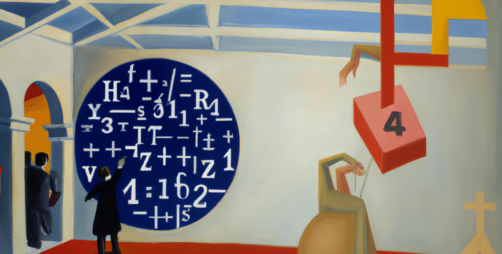
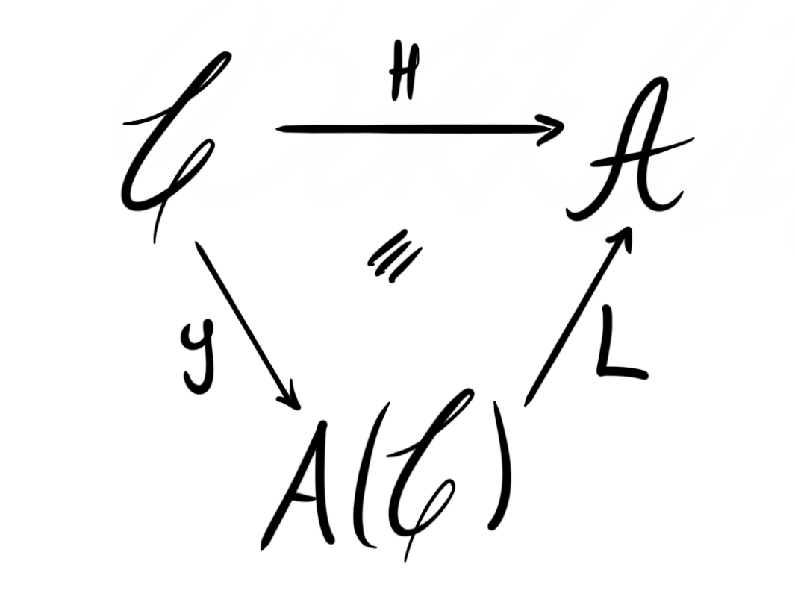

New year; same me; new math. During the fall I said that I wanted to post on this blog monthly, but that did not happen for some reason. I thought I’d try again this semester, but maybe I am setting this not that high bar still too high for my self. For some reason there seems to be fewer hours in the day than it used to. The cover page for the post is generated by Dalle·2 using the prompt "A man finding the universal piece, old painting" – a true work of art. 

Anyway… My research interests very often center around some form of homology or cohomology. We have covered such things several times, as well as explored some different kinds, like [stable homotopy](), [complex cobordism cohomology](), [Brown-Peterson cohomology]() and [Johnson-Wilson theory](). These are all homology theories on topological spaces, on spectra even, and through the [Brown representability theorem]() we know that all such (co)homology theories are in fact representable by a spectrum. Thus we have studied the category of spectra, also sometimes called the [stable homotopy category](), on several occasions. But, there are generalizations of homology theories on spectra to homology theories on general categories, and these are the focus of todays blog post. We will, however, see some remnants of the representability theorem in these cases as well — we will see that the representable homology theories are essentially the only ones, or at least the important ones in some sense. 

## Homology theories

We want now to define homology theories for more general categories. The way we often do this in mathematics is simply to take the properties we care about in the setting we are used to — in this case for topological spaces or spectra — and transport them to the new settings. We focus here on generalizing homology theories on spectra, as these work the same way as for topological spaces, but generalize a bit nicer.

A homology theory on spectra is a functor $H\colon Sp\longrightarrow Ab_*$ from the [stable $\infty$-category]() of spectra into the category of graded abelian groups. A sentral feature we need is that such a functor respects the additive structure that is present in both categories. This means that

1. The zero spectrum gets mapped to the trivial graded abelian group, i.e. $H(0)\simeq0$.
2. The sum of two spectra gets mapped to the sum of their homologies, i.e. $H(E\oplus F) \simeq H(E)\oplus H(F)$. 

Such functors are called additive functors. The reason this is true for all homology theories on spectra is that this is a feature for the $Hom$ functor. Since all homology theories on spectra are representable, it is then a feature for all homology theories. 

For enjoyers of abstract nonsense: We have seen [a long time ago]() that additive categories are the ones enriched over abelian groups. The fact that a homology theory is an additive functor means that it respects this enriched structure; that it is a functor enriched over abelian groups — an $Ab$-enriched functor. 

The next central feature is that a homology theory produces exact sequences. In particular, given a cofiber sequence in spectra $X\longrightarrow Y\longrightarrow Z$, we get an exact sequence 

$$
H(X)\longrightarrow H(Y)\longrightarrow H(Z)
$$

of graded abelian groups. Using the grading and some clever connecting homomorphism, this gives us the familiar long exact sequence in homology that we learn in our first course on algebraic topology. 

The last central feature is that the homology theories on spectra respect the grading we have on both categories. The $\infty$-category $Sp$ is a stable category under the suspension functor $\Sigma$, and the category of graded abelian groups is — as the name implies — graded, often denoted by a shift functor $[1]$. This means, for some graded abelian group $A= \\{A_k \\}_{k\in \mathbb{Z}}$, that we have 

$$
(A[1])_ k = A_{k-1}
$$

A homology theory $H$ on spectra respect these two gradings. We have

$$
H(\Sigma X)\simeq H(X)[1].
$$

These are in fact all the properties that define homology theories on spectra, and thus should be all the properties we need in order to define homology theories on different categories. As said earlier, we simply imitate the above to create our definition. 

 **Definition:**  Let $\mathcal{C}$ be a stable $\infty$-category and $\mathcal{A}$ an abelian category with a grading $[1]\colon\mathcal{A}\to \mathcal{A}.$ A functor $H\colon \mathcal{C}\longrightarrow \mathcal{A}$ is called a homology theory if 

1. It is additive
2. For a cofiber sequence $a\to b\to c$ in $\mathcal{C}$, the sequence $H(a)\to H(b)\to H(c)$ is exact
3. There is a natural isomorphism $H(\Sigma a)\simeq H(a)[1]$ for any $a\in \mathcal{C}$.

The two first axioms define what is usually called a homological functor. This is often a useful definition to use in homological algebra, as sometimes one works with categories without a grading. Homological functors are then the natural functors to use for un-graded abelian categories.

There is naturally also a dual notion, called cohomology theories. For this post we focus on homology theories, but these dual theories are also very useful. 

Let’s give a hopefully familiar class of examples. Let $\mathbb{F}_p$ be the finite field with $p$ elements. Then the mod $p$ singular homology functor 

$$
H_*(–;\mathbb{F}_p)\colon Sp\longrightarrow Vect(\mathbb{F}_p)_*
$$

is a homology theory. This functor sends a space $X$ first to its chain complex of singular chains and then collects all the homology vector spaces of the chain complex into a single graded $\mathbb{F}_p$-vector space.

Let’s see how this general notion of homology theories behave with respect to representability. In other words, do we have a similar type of Brown representability theorem? It turns out that we do, at least for nice homology theories. Since representable functors are functors $H$ such that $H(–)\simeq [–, c]$ for some object $c$, we see that we need to look at functors in the opposite category, just to make everything work as intended. Since $\mathcal{C}$ is an additive category we know that $[–, c]$ lands in abelian groups. We must then restrict ourselves to homological functors $H\colon \mathcal{C}\longrightarrow Ab$ to have any chance of representability [^1]. Note that we also omit the grading, and focus here on homological functors instead of homology theories. 

 **Brown representability:**  Let $\mathcal{C}$ be a presentable stable $\infty$-category and $H\colon \mathcal{C}^{op}\longrightarrow Ab$ a homological functor that takes arbitrary direct sums in $\mathcal{C}$ to direct products of abelian groups. Then $H$ is a representable functor on the homotopy category of $\mathcal{C}$, i.e. the induced functor  

$$
H\colon h\mathcal{C}^{op}\longrightarrow Ab
$$

is representable. 

This fact leads us to the next section of this post. 

"Painting of public interest in mathematics" – Dalle·2

## The Freyd envelope

Before we do the next construction I want to try to motivate what we are doing. We want to study general homology theories $H\colon \mathcal{C}\longrightarrow \mathcal{A}$. We want to know if representable ones are all such functors there is, or at least if they are the most important ones. If we could somehow bundle all these representable homological functors from $\mathcal{C}$ into abelian groups into a nice category, we could maybe use it to study general homological functors and homology theories. Again, the representable ones should somehow be all of them, or at least the most important ones, up to not landing in the category of abelian groups. We are somehow trying to construct a category $\mathcal{U}$ such that representable functors $y\colon \mathcal{C}\longrightarrow \mathcal{U}$ describe “all homology theories” up to some functor transporting us to the category we should be landing in, i.e. some functor $\mathcal{U}\longrightarrow \mathcal{A}$ for a general abelian category $\mathcal{A}$. This in some sense means that $y$ — we will come back to why we call it $y$ soon — is the universal homology theory, and that $\mathcal{U}$ is in some sense the universal place to convert between general homology theories and representable ones into abelian groups. 

Ok, let’s construct the category $\mathcal{U}$. Notice that for any $c\in \mathcal{C}$, the functor it represents, i.e.

$$
[–,c]\colon \mathcal{C}^{op}\longrightarrow Ab
$$

is a homological functor. Here $[–,c]$ is the homotopy classes of maps into the object $c$, 

$$
[–,c]= \pi_0 Map_\mathcal{C}(–,c).
$$

It is also a presheaf of abelian groups on $\mathcal{C}$ by definition. We can start the endeavour by considering the category of all presheaves of abelian groups, denoted $Fun(\mathcal{C}^{op}, Ab)$. Recall that we want our functors to respect the additive structure that is present in both $\mathcal{C}$  and $Ab$, or in abstract nonsense that we should look at $Ab$-enriched functors. Thus we restrict ourselves to so-called additive presheaves, which are those that preserve finite sums. This category is usually denoted $Fun_\Sigma(\mathcal{C}^{op}, Ab)$. 

As an example we again have the functors of the form $[–,c]$ for any object $c\in \mathcal{C}$. These objects in $Fun_\Sigma(\mathcal{C}^{op},Ab)$ are called the representable additive presheaves, and they assemble into a functor $y\colon \mathcal{C}\longrightarrow Fun_\Sigma(\mathcal{C}^{op}, Ab)$ called the Yoneda embedding. This sends an object $c\in \mathcal{C}$ to the presheaf it represents, i.e. the functor $y(c)=[–, c]\colon \mathcal{C}^{op}\longrightarrow Ab$ defined by $y(c)(d)=[d,c]$. 

Now, we have so far not taken into account the representability part of our intuitive idea above. You could ask why we don’t simply define the category we want as the essential image of the Yoneda embedding, but then this category does not have all the properties we want. In essence, it is then not closed under colimits, which is a property we want to have. Thus, we make the following definition. 

 **Definition:**  Let $\mathcal{C}$ be a stable $\infty$-category. We define its Freyd envelope, denoted $A(\mathcal{C})$, to be the smallest full subcategory of $Fun_\Sigma(\mathcal{C}^{op}, Ab)$ that contain all the representable presheaves and is closed under isomorphisms and finite colimits. 

Many are probably happy with this description, but I like having my objects be more explicitly described. We can make the definition of $A(\mathcal{C})$ a bit more precise, and explicit, using the following construction. 

 **Definition:**  Let $X$ be an additive presheaf of abelian groups, i.e. $X\in Fun_\Sigma(\mathcal{C}^{op}, Ab)$. We say $X$ is finitely presented if there exists objects $c$ and $d$ in $\mathcal{C}$ and a cokernel sequence of additive presheaves

$$
y(c)\longrightarrow y(d)\longrightarrow X\longrightarrow 0.
$$

The Freyd envelope $A(\mathcal{C})$ can then be identified with the full subcategory of $Fun_\Sigma(\mathcal{C}^{op}, Ab)$ spanned by the finitely presented presheaves. 

In some sense the Freyd envelope is a translation tool between $\infty$-categories and abelian categories. It is in fact itself an abelian category, and this fact is what gives it its notation. It is in some sense the abelianization of the stable $\infty$-category $\mathcal{C}$, hence the letter $A$ used in the notation. Some places in the literature, maybe especially in the tt-geometry and homological algebra literature, the Frey envelope is sometimes called the category of finitely presented modules over $\mathcal{C}$ and sometimes denoted $mod_\mathcal{C}$ or $mod_{\mathcal{C}}^{fp}$. For those who care, the category $A(\mathcal{C})$ is also related to the category of coherent functors, $coh(\mathcal{C})$. 

### Some properties

The Yoneda embedding $y\colon \mathcal{C}\longrightarrow A(\mathcal{C})$ is a nice functor. The first thing we should want is that it is homological, as it will be our candidate for a universal homology theory. This is in fact the case. In particular, if $\mathcal{C}$ has products and coproducts, then so does $A(\mathcal{C})$ and the embedding preserves these. One could perhaps hope for $y$ to be an actual embedding, in particular that it is fully faithful. This is not the case on the nose, but Yoneda’s lemma gives us that $y$ is fully faithful once we pass to the homotopy category of $\mathcal{C}$, i.e. induced Yoneda embedding functor $h\mathcal{C}\longrightarrow A(\mathcal{hC})$ is fully faithful. We do in fact have an equivalence $A(\mathcal{C})\simeq A(h\mathcal{C})$ induced by the projection $\mathcal{C}\longrightarrow h\mathcal{C}$, hence the failure of $y$ to be fully faithful is only in $\mathcal{C}$ being a stable $\infty$-category and not a triangulated one. 

For $\mathcal{C}$ a stable $\infty$-category, the category $A(\mathcal{C})$ is closed under finite limits, finite colimits, and extensions. It is also an abelian subcategory of the full additive presheaf category $Fun_\Sigma(\mathcal{C}^{op},Ab)$. Being an extension closed subcategory of an abelian category is an example of being an exact category. 

We also have that the representable presheaves, i.e. those in the essential image of the Yoneda embedding, are both injective and projective, and generates the whole category $A(\mathcal{C})$ under finite limits. The representables are not neccesarily *all* the injectives or the projectives. 

Since $\mathcal{C}$ is stable it is locally graded by the suspension functor $\Sigma$. This induces a local grading $[1]\colon A(\mathcal{C})\longrightarrow A(\mathcal{C})$ on the Freyd envelope by defining

$$
X\[1\](c):= X(\Sigma^{-1}c).
$$

As remarked above, the Yoneda embedding is also a homological functor. If $\mathcal{C}$ is stable, thus locally graded, and we use the induced local grading on $A(\mathcal{C})$, then $y$ is also a locally graded functor, meaning that it is in fact a homology theory. In order for this to be true we need an equivalence $y(\Sigma c)\simeq y(c)[1]$. By the definition of the local grading on $A(\mathcal{C})$ we can check this on objects, i.e.

$$
y(\Sigma c)(d)=[d, \Sigma c]\simeq [\Sigma^{-1}d, c]= y(c)(\Sigma^{-1}d)=y(c)\[1\](d)
$$

where the middle equivalence is due to $\mathcal{C}$  being stable, and the last by the definition of the local grading on $A(\mathcal{C})$. This is why we defined the local grading on $A(\mathcal{C})$ in the way we did — presicely to get that $y$ is a functor of locally graded categories. 

In the brief intuitive formulation we had in the beginning of this section we denoted the universal category where we do homology by $\mathcal{U}$, to emphasize exactly its universality. It comes perhaps as no surprise that this universal $\mathcal{U}$ is in fact the Freyd envelope, so let’s now see this universality. 

Another iteration of "A man finding the universal piece, old painting" – Dalle·2

## Universality of the Yoneda embedding

As we stated, we somehow want the Yoneda embedding $y\colon \mathcal{C}\longrightarrow A(\mathcal{C})$ from the stable $\infty$-category $\mathcal{C}$ into its Freyd envelope to be the universal homology theory, but what does it mean to be universal in this setting? 

Recall that an additive functor $L\colon \mathcal{A}\longrightarrow \mathcal{B}$ between abelian categories is called exact if it sends exact sequences to exact sequences. These are exactly the structure preserving morphism between abelian categories. So, since a homology theory sends fiber sequences to exact sequences we can compose any homology theory with an exact functor and still get a homology theory. In some sense this means that exact functors just transport the “homology objects” into a new setting, while still respecting their “homological objectness”. Being a universal homology theory can then be formulated as the property that any other homology theory factors through the universal one up to a composition by an exact functor, in some unique way. In other words, the universal homology theory is “where homology happens” and the exact functor just transports the “homology objects” uniquely into the correct setting we are interested in. 

This idea might become more clear with the following theorem, claiming that the Yoneda embedding is the universal homological functor. 

 **Theorem:**  Let $\mathcal{C}$  be a stable $\infty$-category. For any homological functor $H\colon \mathcal{C}\longrightarrow \mathcal{A}$, there is an essentially unique exact functor $L\colon A(\mathcal{C})\longrightarrow \mathcal{A}$ of abelian categories such that $H=L\circ y$, i.e. the following diagram commutes

 

Being essentially unique, as in the theorem, means that it is unique up to natural isomorphism of functors. If two homological functors are naturally equivalent, then this natural equivalence also factors through a natural equivalence of their respective universal factorizations, i.e. if $H_1\simeq H_2$  as homological functors, then the respective exact functors $L_1$ and $L_2$ are also naturally isomorphic. 

We wanted to have a universal homology theory, not just a homological functor, hence we need to ensure that the above functors also respects the local gradings when $H$ is a homology theory and not just a homological functor. We saw earlier that the Yoneda embedding $y$ is in fact a locally graded functor when $\mathcal{C}$ is stable and we use the induced local grading on $A(\mathcal{C})$. We thus need to promote $L$ to a functor of locally graded categories. 

We now have a local grading on both $A(\mathcal{C})$ and $\mathcal{A}$, which we denote by $[1]_ {A(\mathcal{C})}$ and $[1]_\mathcal{A}$ respectively. In order for $L$ to be a locally graded exact functor we need that $L(X[1]_{A(\mathcal{C})})\simeq L(X)[1]_\mathcal{A}$ for any object $X\in A(\mathcal{C})$. Since now $H$ is an homology theory we have $H(\Sigma c)\simeq H(c)[1]_{\mathcal{A}}$. This means in particular that the two functors $H(\Sigma(–))$ and $H(–)[1]_\mathcal{A}$ are naturally isomorphic as functors $\mathcal{C}\longrightarrow \mathcal{A}$. Since they are homological functors, they have a factorization through the Yoneda embedding by the theorem above

$$
H\circ \Sigma\colon \mathcal{C}\overset{y}\longrightarrow A(\mathcal{C})\overset{L_1}\longrightarrow \mathcal{A}
$$

$$
[1]_\mathcal{A}\circ H\colon \mathcal{C}\overset{y}\longrightarrow A(\mathcal{C})\overset{L_2}\longrightarrow \mathcal{A}
$$

This first functor is given, up to isomorphism, by $L\circ [1]_ {A(\mathcal{C})}$ and the second by $[1]_\mathcal{A}\circ L$. We can see this by precomposing with the Yoneda embedding. This gives

$$
L\circ [1]_{A(\mathcal{C})}\circ y \simeq L\circ y\circ \Sigma \simeq H\circ \Sigma,
$$

where the first equivalence holds because $y$ is a functor of locally graded categories, and 

$$
[1]_ \mathcal{A}\circ L \circ y \simeq [1]_{\mathcal{A}}\circ H.
$$

By the uniqueness of these factorizations through the Yoneda embedding we must then have that $L_1\simeq L\circ [1]_ {A(\mathcal{C})}$ and $L_2\simeq [1]_\mathcal{A}\circ L$. Since $H\circ \Sigma \simeq [1]_{\mathcal{A}}\circ H$, as $H$ is a homology theory, we know by the uniqueness of the factorization that also their respective functors $L_1$ and $L_2$ are naturally isomorphic. Hence we finally get

$$
L\circ [1]_ {A(\mathcal{C})}\simeq L_1\simeq L_2\simeq [1]_\mathcal{A}\circ L,
$$

which precisely shows that $L$ is a functor of locally graded categories. This means that the Yoneda embedding $y\colon \mathcal{C}\longrightarrow A(\mathcal{C})$ is the universal homology theory!

Let's summarize this into a theorem.

 **Theorem:**  Let $\mathcal{C}$  be a stable $\infty$-category. For any homology theory $H\colon \mathcal{C}\longrightarrow \mathcal{A}$, there is an essentially unique exact functor $L\colon A(\mathcal{C})\longrightarrow \mathcal{A}$ of locally graded abelian categories such that $H=L\circ y$. 

We will expand on this result in the next blog post, where we try to make some sensible criteria on the locally graded abelian category $\mathcal{A}$ in order to get a really nice homology theory. These are called the adapted homology theories, and are exactly the ones where we get nice [spectral sequences]() allowing us to use the homology theory as an algebraic approximation to things we are interested in. 

[^1]: One could go all the way down to $Set$ instead of $Ab$, but as $\mathcal{C}$ is additive — which we know means $Ab$-enriched — we want to take values in the category we are enriched over.